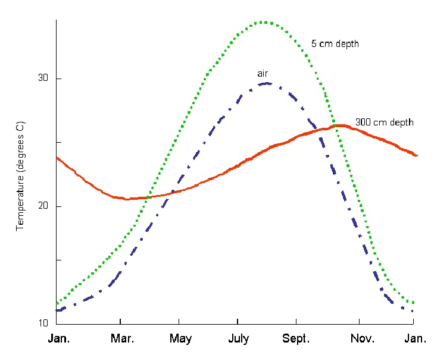

# 1:1.3.3 Soil Temperature

Soil temperature will fluctuate due to seasonal and diurnal variations in temperature at the surface. Figure 1:1-2 plots air temperature and soil temperature at 5 cm and 300 cm below bare soil at College Station, Texas.&#x20;

This figure illustrates several important attributes of temperature variation in the soil. First, the annual variation in soil temperature follows a sinusoidal function. Second, the fluctuation in temperature during the year (the amplitude of the sine wave) decreases with depth until, at some depth in the soil, the temperature remains constant throughout the year. Finally, the timing of maximum and minimum temperatures varies with depth. Note in the above graph that there is a three month difference between the recording of the minimum temperature at the surface (January) and the minimum temperature at 300 cm (March).

&#x20;Carslaw and Jaeger (1959) developed an equation to quantify the seasonal variation in temperature:

$$T_{soil}(z,d_n)=\overline T_{AA} +A_{surf}exp(-z/dd)sin(\omega_{tmp}d_n-z/dd)$$                                                             1:1.3.2

where $$T_{soil}(z,d_n)$$ is the soil temperature ($$\degree C$$) at depth $$z$$(mm) and day of the year $$d_n$$ , $$\overline T_{AA}$$ is the average annual soil temperature ($$\degree C$$), $$A_{surf}$$ is the amplitude of the surface fluctuations ($$\degree C$$), $$dd$$ is the damping depth (mm) and $$\omega_{tmp}$$ is the angular frequency. When $$z=0$$ (soil surface), equation 1:1.3.2 reduces to $$T_{soil}(0,d_n)=\overline T_{AA} + A_{surf}sin(\omega_{tmp}d_n).$$ As $$z$$ $$\rightarrow \infty$$, equation 1:1.3.2 becomes $$T_{soil}(\infty,d_n)=\overline T_{AA}$$.

In order to calculate values for some of the variables in this equation, the heat capacity and thermal conductivity of the soil must be known. These are properties not commonly measured in soils and attempts at estimating values from other soil properties have not proven very effective. Consequently, an equation has been adopted in SWAT+ that calculates the temperature in the soil as a function of the previous day’s soil temperature, the average annual air temperature, the current day’s soil surface temperature, and the depth in the profile.&#x20;

The equation used to calculate daily average soil temperature at the center of each layer is:

$$T_{soil}(z,d_n)=\ell T_{soil}(z,d_n1)+[1.0-\ell] [df [\overline T_{AAair}-T_{ssurf}]+T_{ssurf}]$$                                           1:1.3.3

where $$T_{soil}(z,d_n)$$ is the soil temperature ($$\degree C$$) at depth $$z$$ (mm) and day of the year $$d_n$$, $$\ell$$ is the lag coefficient (ranging from 0.0 to 1.0) that controls the influence of the previous day's temperature on the current day's temperature , $$T_{soil}(z,d_n-1)$$ is the soil temperature ($$\degree C$$) in the layer from the previous day, $$df$$ is the depth factor that quantifies the influence of depth below surface on soil temperature , $$\overline T_{AAair}$$ is the average annual temperature ($$\degree C$$), and $$T_{ssurf}$$ is the soil surface temperature on the day. SWAT+ sets the lag coefficient, $$\ell,$$ to 0.80. The soil temperature from the previous day is known and the average annual air temperature is calculated from the long-term monthly maximum and minimum temperatures reported in the weather generator input ([weather-wgn.cli](../../../../introduction-1/climate/weather-wgn.cli/)) file. This leaves the depth factor, $$df$$, and the soil surface temperature, $$T_{ssurf}$$, to be defined.&#x20;

The depth factor is calculated using the equation:

$$df=\frac{zd}{zd+exp(-0.867-2.078 zd)}$$                                                                                                                                 1:1.3.4

where $$zd$$ is the ratio of the depth at the center of the soil layer to the damping depth:

$$zd=\frac{z}{dd}$$                                                                                                                                                                     1:1.3.5

where $$z$$ is the depth at the center of the soil layer (mm) and $$dd$$ is the damping depth (mm).&#x20;

From the previous three equations (1:1.3.3, 1:1.3.4 and 1:1.3.5) one can see that at depths close to the soil surface, the soil temperature is a function of the soil surface temperature. As the depth increases, soil temperature is increasingly influenced by the average annual air temperature, until at the damping depth, the soil temperature is within 5% of $$\overline T_{AAair}$$.&#x20;

The damping depth, $$dd$$, is calculated daily and is a function of the maximum damping depth, bulk density and soil water. The maximum damping depth, $$dd_{max}$$, is calculated:

$$dd_{max} = 1000+\frac{2500\rho_b}{\rho_b+686exp(-5.63\rho_b)}$$                                                                                                                   1:1.3.6

where $$dd_{max}$$ is the maximum damping depth (mm), and $$b$$ is the soil bulk density ($$Mg/m^3$$). The impact of soil water content on the damping depth is incorporated via a scaling factor,, that is calculated with the equation:

$$\varphi=\frac{SW}{(0.356-0.144\rho_b) z_{tot}}$$                                                                                                                                             1:1.3.7

where $$SW$$ is the amount of water in the soil profile expressed as depth of water in the profile (mm $$H_{2}O$$), $$\rho_b$$ is the soil bulk density ($$Mg/m^3$$), and $$z_{tot}$$ is the depth from the soil surface to the bottom of the soil profile (mm).&#x20;

The daily value for the damping depth, $$dd$$, is calculated:    &#x20;

$$dd=dd_{max} exp[ln(\frac{500}{dd_{max}}) (\frac{1-\varphi}{1+\varphi})^2]$$                                                                                                                   1:1.3.8

where $$dd_{max}$$ is the maximum damping depth (mm), and is the scaling factor for soil water. The soil surface temperature is a function of the previous day’s temperature, the amount of ground cover and the temperature of the surface when no cover is present. The temperature of a bare soil surface is calculated with the equation:&#x20;

$$T_{bare}=\overline T_{av}+\varepsilon_{sr} \frac{(T_{mx}-T_{mn})}{2}$$                                                                                                                            1:1.3.1.9

where $$T_{bare}$$ is the temperature of the soil surface with no cover ($$\degree C$$), $$\overline T_{av}$$ is the average temperature on the day ($$\degree C$$), $$T_{mx}$$ is the daily maximum temperature ($$\degree C$$), $$T_{mn}$$ is the daily minimum temperature         ($$\degree C$$), and $$\varepsilon_{sr}$$ is a radiation term. The radiation term is calculated with the equation:

$$\varepsilon_{sr}=\frac{H_{day} (1-\alpha)-14}{20}$$                                                                                                                                               1:1.3.10

where $$H_{day}$$ is the solar radiation reaching the ground on the current day ($$MJ m^{-2}d^{-1}$$), and $$\alpha$$ is the albedo for the day. Any cover present will significantly impact the soil surface temperature. The influence of plant canopy or snow cover on soil temperature is incorporated with a weighting factor, $$bcv$$, calculated as:

$$bcv=max \{{{\frac{CV}{CV+exp(7.563-1.297X10^-4*CV)}}}, \frac{SNO}{SNO+exp(6.055-0.3002*SNO)}\}$$                                               1:1.3.11

where $$CV$$ is the total aboveground biomass and residue present on the current day (kg ha$$^{-1}$$) and SNO is the water content of the snow cover on the current day (mm $$H_2O$$ ). The weighting factor, $$bcv$$, is 0.0 for a bare soil and approaches 1.0 as cover increases.&#x20;

The equation used to calculate the soil surface temperature is:

$$T_{ssurf}=bcv T_{soil}(1,d_n-1)+(1-bcv) T_{bare}$$                                                                                         1:1.3.12

where $$T_{ssurf}$$ is the soil surface temperature for the current day ($$\degree C$$), $$bcv$$ is the weighting factor for soil cover impacts, $$T_{soil}(1,d_n-1)$$ is the soil temperature of the first soil layer on the previous day ($$\degree C$$), and $$T_{bare}$$ is the temperature of the bare soil surface ($$\degree C$$). The influence of ground cover is to place more emphasis on the previous day’s temperature near the surface.&#x20;

SWAT+ input variables that directly impact soil temperature calculations are listed in Table 1:1-7. There are several other variables that initialize residue and snow cover in the subbasins or HRUs (snow\_init in [snow.sno](../../../../introduction-1/hydrology/snow.sno/) and rsd\_init in [plant.ini](../../../../introduction-1/landuse-and-management/plant.ini/)). The influence of these variables will be limited to the first few months of simulation. Finally, the timing of management operations in the [management.sch](../../../../introduction-1/landuse-and-management/management.sch/) file will affect ground cover and consequently soil temperature.

Table 1:1-7: SWAT+ input variables that pertain to soil temperature.

| Definition                                                 | Source Name | Input Name    | Input File                                                                       |
| ---------------------------------------------------------- | ----------- | ------------- | -------------------------------------------------------------------------------- |
| Average maximum air temperature for month ($$\degree C$$)  | tmpmx       | tmp\_max\_ave | [weather-wgn.cli](../../../../introduction-1/climate/weather-wgn.cli/)           |
| Average minimum air temperature for month ($$\degree C$$)  | tmpmn       | tmp\_min\_ave | [weather-wgn.cli](../../../../introduction-1/climate/weather-wgn.cli/)           |
| $$z$$: Depth from soil surface to bottom of layer (mm)     | z           | dp            | [soils.sol](../../../../introduction-1/soils/soils.sol/)                         |
| $$b$$: Moist bulk density (Mg m$$^{-3}$$ or g cm$$^{-3}$$) | bd          | bd            | [soils.sol](../../../../introduction-1/soils/soils.sol/)                         |
| Moist soil albedo of the top layer                         | alb         | alb           | [soils.sol](../../../../introduction-1/soils/soils.sol/)                         |
| $$T_{mx}$$: Daily maximum temperature ($$\degree C$$)      | max temp    | tmpmax        | [.tmp](../../../../introduction-1/climate/tmp.cli-and-temperature-data-files.md) |
| $$T_{mn}$$: Daily minimum temperature ($$\degree C$$)      | min temp    | tmpmin        | [.tmp](../../../../introduction-1/climate/tmp.cli-and-temperature-data-files.md) |

