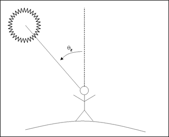

# 🌄 1:1.1.3 Solar Noon, Sunrise, Sunset, and Daylength

The angle between the line from an observer on the earth to the sun and a vertical line extending upward from the observer is called the zenith angle, $$\theta_z$$ (Figure 1:1-1). Solar noon occurs when this angle is at its minimum value for the day.

&#x20;

For a given geographical position, the relationship between the sun and a horizontal surface on the earth's surface is:

$$\cos\theta_z = \sin\delta\sin\phi + \cos\delta \cos\phi\cos\omega t$$                                                                                                       1:1.1.3

where $$\delta$$ is the solar declination in radians, $$\phi$$ is the geographic latitude in radians, $$\omega$$ is the angular velocity of the earth's rotation (0.2618 rad $$h^{-1}$$ or 15˚ $$h^{-1}$$), and t is the solar hour. $$t$$ equals zero at solar noon, is a positive value in the morning, and is a negative value in the evening. The combined term $$\omega t$$ is referred to as the hour angle.&#x20;

Sunrise, $$T_{SR}$$, and sunset, $$T_{SS}$$, occur at equal times before and after solar noon. These times can be determined by rearranging the above equation as:

$$T_{SR} = +(\cos^{-1}[-\tan\delta \tan\phi]/\omega)$$                                                                                                                1:1.1.4

and&#x20;

$$T_{SS} = - (\cos^{-1}[-tan \delta  \tan\phi]/\omega)$$                                                                                                                  1:1.1.5

Total daylength, $$T_{DL}$$ is calculated:&#x20;

$$T_{DL} = (2 \cos^ {-1}[-1\tan \delta \tan \phi]/\omega)$$                                                                                                              1:1.1.6

At latitudes above $$66.5\degree$$or below $$-66.5\degree$$, the absolute value of \[ $$-\tan\delta \tan\phi$$ ] can exceed 1 and the above equation cannot be used. When this happens, there is either no sunrise (winter) or no sunset (summer) and $$T_{DL}$$ must be assigned a value of 0 or 24 hours, respectively.&#x20;

To determine the minimum daylength that will occur during the year, equation 1:1.1.6 is solved with the solar declination set to $$-23.5\degree$$ (-0.4102 radians) for the northern hemisphere or $$+23.5\degree$$ (0.4102 radians) for the southern hemisphere.

The only SWAT+ input variable used in the calculations reviewed in Section 1:1.1 is given in Table 1:1-1.

Table 1:1-1: SWAT+ input variables that are used in earth-sun relationship calculations.

<table data-header-hidden><thead><tr><th width="191.28689431071913">Definition</th><th>Source Name</th><th width="176">Input Name</th><th>Input File</th></tr></thead><tbody><tr><td>Definition</td><td>Source Name</td><td>Input Name</td><td>Input file</td></tr><tr><td>Latitude of the weather generator station (degrees).</td><td>lat</td><td>latitude</td><td><a href="../../../../introduction-1/climate/weather-wgn.cli/">weather-wgn.cli</a></td></tr></tbody></table>
