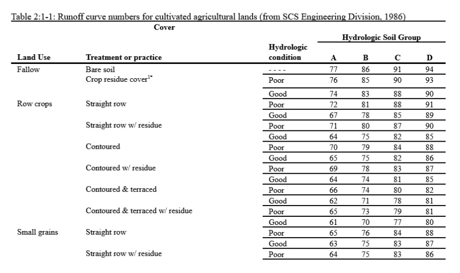
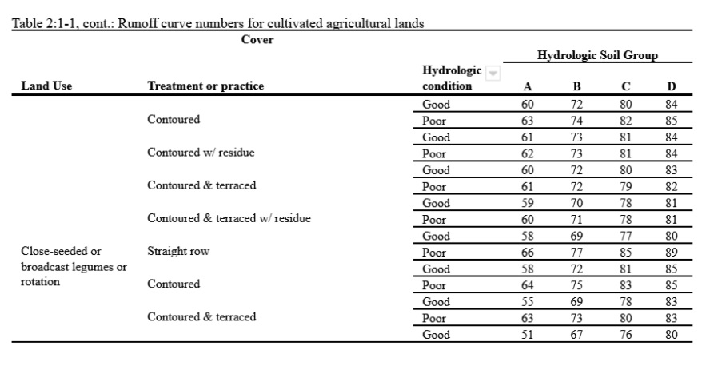

# 2:1.1.1 SCS Curve Number

The SCS curve number is a function of the soil’s permeability, land use and antecedent soil water conditions. Typical curve numbers for moisture condition II are listed in tables 2:1-1, 2:1-2 and 2:1-3 for various land covers and soil types (SCS Engineering Division, 1986). These values are appropriate for a 5% slope.

Table 2:1-1: Runoff curve numbers for cultivated agricultural lands (from SCS Engineering Division, 1986)

Table 2:1-2: Runoff curve numbers for other agricultural lands (from SCS Engineering Division, 1986)

![\[2\] Poor: < 50% ground cover or heavily grazed with no mulch;  Fair:  50 to 75% ground cover and not heavily grazed;  Good:  > 75% ground cover and lightly or only occasionally grazed.&#x20;
\[3\] Poor:  < 50% ground cover;  Fair:  50 to 75% ground cover;  Good:  > 75% ground cover. &#x20;
\[4\] Poor: Forest litter, small trees, and brush are destroyed by heavy grazing or regular burning;  Fair:  Woods are grazed but not burned, and some forest litter covers the soil;  Good:  Woods are protected from grazing, and litter and brush adequately cover the soil.](../../../../../.gitbook/assets/TABLE3.jpg)

Table 2:1-3: Runoff curve numbers for urban areas (from SCS Engineering Division, 1986)

![\[5\] SWAT will automatically adjust curve numbers for impervious areas when IURBAN and URBLU are defined in the .hru file. Curve numbers from Table 6-3 should not be used in this instance.
\[6\] Poor:  < 50% grass cover;  Fair:  50 to 75% grass cover;  Good:  > 75% grass cover](../../../../../.gitbook/assets/TABLE4.jpg)
