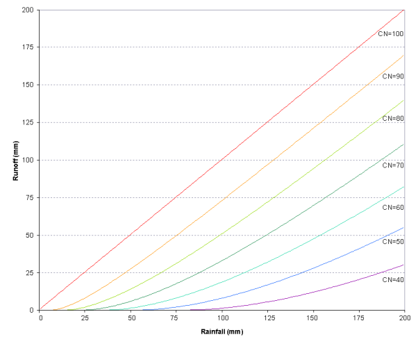

# 2:1.1 Runoff Volume: SCS Curve Number Procedure

The SCS runoff equation is an empirical model that came into common use in the 1950s. It was the product of more than 20 years of studies involving rainfall-runoff relationships from small rural watersheds across the U.S. The model was developed to provide a consistent basis for estimating the amounts of runoff under varying land use and soil types (Rallison and Miller, 1981).

The SCS curve number equation is (SCS, 1972):

$$Q_{surf}=\frac{(R_{day}-I_a)^2}{(R_{day}-I_a+S)}$$                                                                                                                                              2:1.1.1

where $$Q_{surf}$$ is the accumulated runoff or rainfall excess (mm H$$_2$$O), $$R_{day}$$ is the rainfall depth for the day (mm H$$_2$$O), $$I_a$$ is the initial abstractions which includes surface storage, interception and infiltration prior to runoff (mm H$$_2$$O), and $$S$$ is the retention parameter (mm H$$_2$$O). The retention parameter varies spatially due to changes in soils, land use, management and slope and temporally due to changes in soil water content. The retention parameter is defined as:

$$S=25.4(\frac{1000}{CN}-10)$$                                                                                                                                           2:1.1.2

where $$CN$$ is the curve number for the day. The initial abstractions, $$I_a$$, is commonly approximated as $$0.2S$$ and equation 2:1.1.1 becomes

$$Q_{surf}=\frac{(R_{day}-0.2S)^2}{(R_{day}+0.8S)}$$                                                                                                                                             2:1.1.3

Runoff will only occur when $$R_{day}> I_a$$. A graphical solution of equation 2:1.1.3 for different curve number values is presented in Figure 2:1-1.

<figure><figcaption>
Figure 2:1-1: Relationship of runoff to rainfall in SCS curve number method.
</figcaption></figure>

