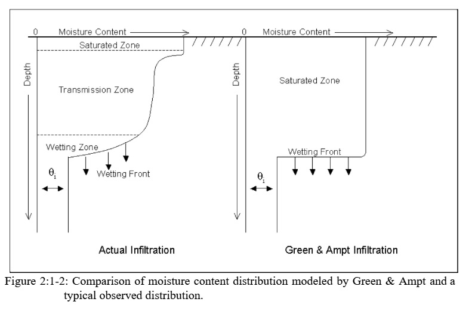

# 2:1.2 Runoff Volume: Green & Ampt Infiltration Method

The Green & Ampt equation was developed to predict infiltration assuming excess water at the surface at all times (Green & Ampt, 1911). The equation assumes that the soil profile is homogenous and antecedent moisture is uniformly distributed in the profile. As water infiltrates into the soil, the model assumes the soil above the wetting front is completely saturated and there is a sharp break in moisture content at the wetting front. Figure 2:1-2 graphically illustrates the difference between the moisture distribution with depth modeled by the Green & Ampt equation and what occurs in reality.

Mein and Larson (1973) developed a methodology for determining ponding time with infiltration using the Green & Ampt equation. The Green-Ampt Mein-Larson excess rainfall method was incorporated into SWAT+ to provide an alternative option for determining surface runoff. This method requires sub-daily precipitation data supplied by the user.

The Green-Ampt Mein-Larson infiltration rate is defined as:

$$f_{inf,t}=K_e*(1+\frac{\Psi_{wf}*\Delta\theta_v}{F_{inf,t}})$$                                                                                                                              2:1.2.1

where $$f_{inf}$$ is the infiltration rate at time $$t$$ (mm/hr), $$K_e$$ is the effective hydraulic conductivity (mm/hr), $$\Psi_{wf}$$ is the wetting front matric potential (mm), $$\Delta\theta_v$$ is the change in volumetric moisture content across the wetting front (mm/mm) and $$F_{inf}$$ is the cumulative infiltration at time $$t$$ (mm H$$_2$$O).&#x20;

When the rainfall intensity is less than the infiltration rate, all the rainfall will infiltrate during the time period and the cumulative infiltration for that time period is calculated:

$$F_{inf,t}=F_{inf,t-1}+R_{\Delta t}$$                                                                                                                                      2:1.2.2

where $$F_{inf,t}$$ is the cumulative infiltration for a given time step (mm H$$_2$$O), $$F_{inf,t-1}$$ is the cumulative infiltration for the previous time step(mm H$$_2$$O), and $$R_{\Delta t}$$ is the amount of rain falling during the time step (mm H$$_2$$O).

The infiltration rate defined by equation 2:1.2.1 is a function of the infiltrated volume, which in turn is a function of the infiltration rates in previous time steps. To avoid numerical errors over long time steps, $$f_{inf}$$ is replaced by $$dF_{inf}/dt$$ in equation 2:1.2.1 and integrated to obtain

$$F_{inf,t}=F_{inf,t-1}+K_e*\Delta t+ \Psi_{wf}*\Delta\theta_v*ln[\frac{F_{inf,t}+\Psi_{wf}*\Delta\theta_v}{F_{inf,t-1}+\Psi_{wf}*\Delta\theta_v}]$$                                                         2:1.2.3

Equation 2:1.2.3 must be solved iteratively for $$F_{inf,t}$$, the cumulative infiltration at the end of the time step. A successive substitution technique is used.

The Green-Ampt effective hydraulic conductivity parameter, $$K_e$$, is approximately equivalent to one-half the saturated hydraulic conductivity of the soil, $$K_{sat}$$ (Bouwer, 1969). Nearing et al. (1996) developed an equation to calculate the effective hydraulic conductivity as a function of saturated hydraulic conductivity and curve number. This equation incorporates land cover impacts into the calculated effective hydraulic conductivity. The equation for effective hydraulic conductivity is:

$$K_e=\frac{56.82*K_{sat}^{0.286}}{1+0.051*exp(0.062*CN)}-2$$                                                                                                                          2:1.2.4

where $$K_e$$ is the effective hydraulic conductivity (mm/hr), $$K_{sat}$$ is the saturated hydraulic conductivity (mm/hr), and $$CN$$ is the curve number.                      &#x20;

Wetting front matric potential, $$\Psi_{wf}$$, is calculated as a function of porosity, percent sand and percent clay (Rawls and Brakensiek, 1985):

$$\Psi_{wf}=10*exp[6.5309-7.32561*\phi_{soil}+0.001583*m_c^2+3.809479*\phi_{soil}^2+0.000344*m_s*m_c-0.049837*m_s*\phi_{soil}+0.001608*m_s^2*\phi_{soil}^2+0.001602*m_c^2*\phi_{soil}^2-0.0000136*m_s^2*m_c-0.003479*m_c^2*\phi_{soil}-0.000799*m_s^2*\phi_{soil}]$$

&#x20;                                                                                                                                                                                    2:1.2.5

where $$\phi_{soil}$$ is the porosity of the soil (mm/mm), $$m_c$$ is the percent clay content, and $$m_s$$ is the percent sand content.

The change in volumetric moisture content across the wetting front is calculated at the beginning of each day as:

$$\Delta\theta_v=(1-\frac{SW}{FC})*(0.95*\phi_{soil})$$                                                                                                                   2:1.2.6

where $$\Delta\theta_v$$ is the change in volumetric moisture content across the wetting front (mm/mm), $$SW$$ is the soil water content of the entire profile excluding the amount of water held in the profile at wilting point (mm H$$_2$$O), $$FC$$ is the amount of water in the soil profile at field capacity (mm H$$_2$$O), and $$\phi_{soil}$$ is the porosity of the soil (mm/mm). If a rainfall event is in progress at midnight, $$\Delta\theta_v$$ is then calculated:

&#x20;$$\Delta\theta_v=0.001*(0.95*\phi_{soil})$$                                                                                                                           2:1.2.7

For each time step, SWAT+ calculates the amount of water entering the soil. The water that does not infiltrate into the soil becomes surface runoff.

Table 2:1-2: SWAT+ input variables that pertain to Green & Ampt infiltration calculations.

| Definition                                                                         | Source Name | Input Name    | Input File |
| ---------------------------------------------------------------------------------- | ----------- | ------------- | ---------- |
| Rainfall, runoff, routing option.                                                  |             | IEVENT        | .bsn       |
| Length of time step (min): $$\Delta t$$=IDT/60                                     |             | IDT           | file.cio   |
| $$R_{\Delta t}$$: Precipitation during time step (mm H$$_2$$O)                     |             | PRECIPITATION | .pcp       |
| $$K_{sat}$$: Saturated hydraulic conductivity of first layer (mm/hr)               |             | SOL\_K        | .sol       |
| $$CN$$: Moisture condition II curve number                                         |             | CN2           | .mgt       |
| $$CN$$: Moisture condition II curve number                                         |             | CNOP          | .mgt       |
| $$\rho_b$$: Moist bulk density (Mg/$$m^3$$): $$\Psi_{soil}$$=1 - $$\rho_b$$ / 2.65 |             | SOL\_BD       | .sol       |
| $$m_c$$: % clay content                                                            |             | CLAY          | .sol       |
| $$m_s$$: % sand content                                                            |             | SAND          | .sol       |
