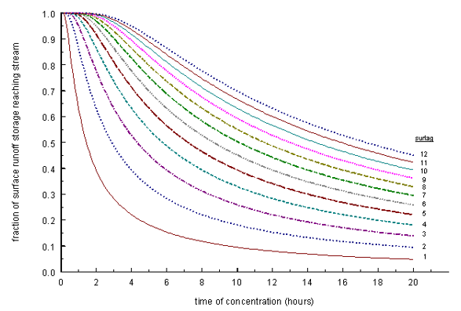

# 2:1.4 Surface Runoff Lag

In large subbasins with a time of concentration greater than 1 day, only a portion of the surface runoff will reach the main channel on the day it is generated. SWAT+ incorporates a surface runoff storage feature to lag a portion of the surface runoff release to the main channel.

Once surface runoff is calculated with the Curve Number or Green & Ampt method, the amount of surface runoff released to the main channel is calculated:

$$Q_{surf}=(Q'_{surf}+Q_{stor,i-1})*(1-exp[\frac{-surlag}{t_{conc}}])$$                                                                                   2:1.4.1

where $$Q_{surf}$$ is the amount of surface runoff discharged to the main channel on a given day (mm H$$_2$$O), is the amount of surface runoff generated in the subbasin on a given day (mm H$$_2$$O), $$Q_{stor,i-1}$$ is the surface runoff stored or lagged from the previous day (mm H$$_2$$O), $$surlag$$ is the surface runoff lag coefficient, and $$t_{conc}$$ is the time of concentration for the subbasin (hrs).

The expression$$(1-exp[\frac{-surlag}{t_{conc}}])$$ in equation 2:1.4.1 represents the fraction of the total available water that will be allowed to enter the reach on any one day. Figure 2:1-3 plots values for this expression at different values for $$surlag$$and $$t_{conc}$$.

<figure><figcaption>
Figure 2:1-3: Influence of surlag and t_{conc} on fraction of surface runoff released.
</figcaption></figure>

Note that for a given time of concentration, as $$surlag$$ decreases in value more water is held in storage. The delay in release of surface runoff will smooth the streamflow hydrograph simulated in the reach.

Table 2:1-6: SWAT+ input variables that pertain to surface runoff lag calculations.

| Definition                                 | Source Code Variable | Input Name                                                              | Input File                                                        |
| ------------------------------------------ | -------------------- | ----------------------------------------------------------------------- | ----------------------------------------------------------------- |
| $$surlag$$: Surface runoff lag coefficient | surlag               | [surq\_lag](../../../introduction-1/basin-1/parameters.bsn/surq_lag.md) | [parameters.bsn](../../../introduction-1/basin-1/parameters.bsn/) |

