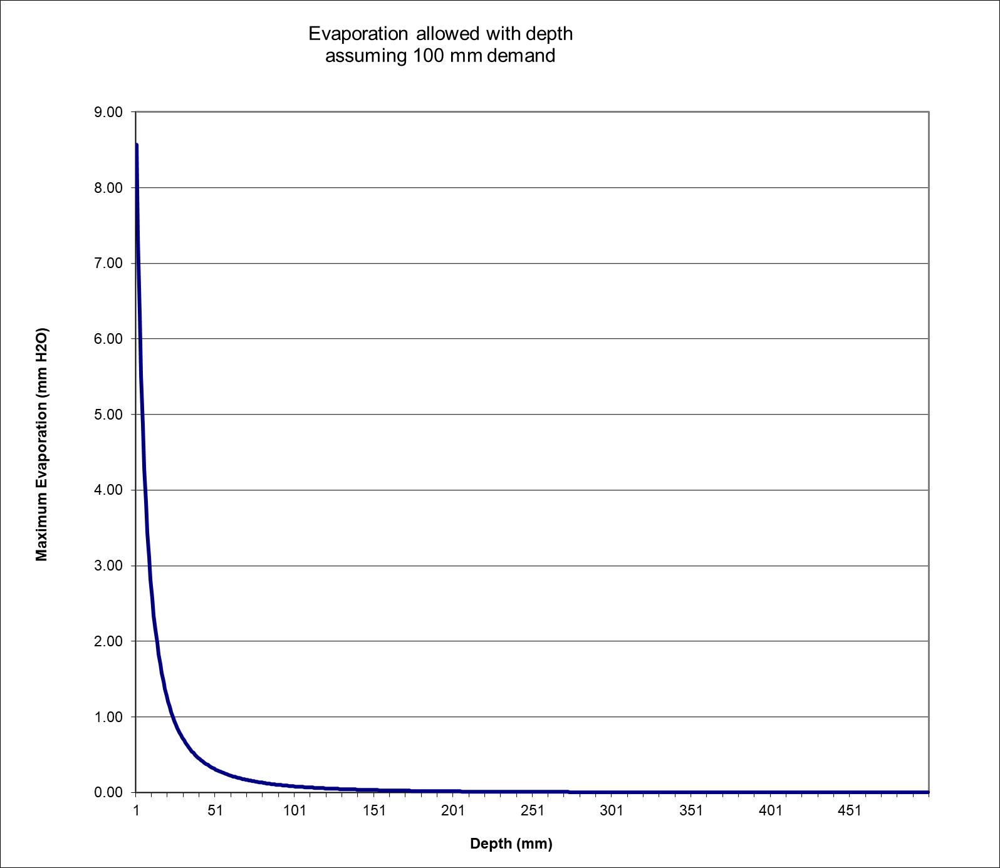
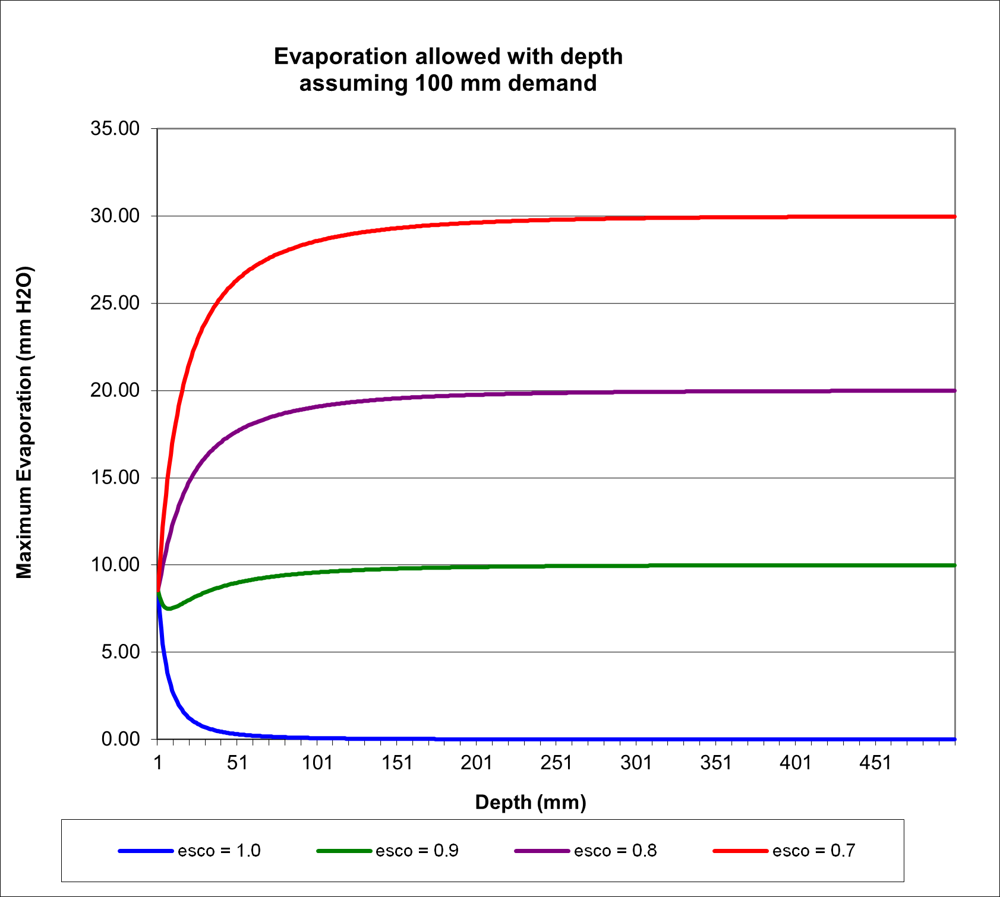

# 2:2.3.3.2 Soil Water Evaporation

When an evaporation demand for soil water exists, SWAT+ must first partition the evaporative demand between the different layers. The depth distribution used to determine the maximum amount of water allowed to be evaporated is:

$$E_{soil,z}=E''_s*\frac{z}{z+exp(2.374-0.00713*z)}$$                                                                                                              2:2.3.16

where $$E_{soil,z}$$ is the evaporative demand at depth $$z$$ (mm H$$_2$$O), $$E''_s$$ is the maximum soil water evaporation on a given day (mm H$$_2$$O), and $$z$$ is the depth below the surface. The coefficients in this equation were selected so that 50% of the evaporative demand is extracted from the top 10 mm of soil and 95% of the evaporative demand is extracted from the top 100 mm of soil.

The amount of evaporative demand for a soil layer is determined by taking the difference between the evaporative demands calculated at the upper and lower boundaries of the soil layer:

$$E_{soil,ly}=E_{soil,zl}-E_{soil,zu}$$                                                                                                                              2:2.3.17

where $$E_{soil,ly}$$ is the evaporative demand for layer $$ly$$ (mm H$$_2$$O), $$E_{soil,zl}$$ is the evaporative demand at the lower boundary of the soil layer (mm H$$_2$$O), and $$E_{soil,zu}$$ is the evaporative demand at the upper boundary of the soil layer (mm H$$_2$$O).

Figure 2:2-1 graphs the depth distribution of the evaporative demand for a soil that has been partitioned into 1 mm layers assuming a total soil evaporation demand of 100 mm.

<figure><figcaption>
Figure 2:2-1: Soil evaporative demand distribution with depth.
</figcaption></figure>

As mentioned previously, the depth distribution assumes 50% of the evaporative demand is met by soil water stored in the top 10 mm of the soil profile. With our example of a 100 mm total evaporative demand, 50 mm of water is 50%. This is a demand that the top layer cannot satisfy.

SWAT+ does not allow a different layer to compensate for the inability of another layer to meet its evaporative demand. The evaporative demand not met by a soil layer results in a reduction in actual evapotranspiration for the HRU.

A coefficient has been incorporated into equation 2:2.3.17 to allow the user to modify the depth distribution used to meet the soil evaporative demand. The modified equation is:

$$E_{soil,ly}=E_{soil,zl}-E_{soil,zu}*esco$$                                                                                                                2:2.3.18

where $$E_{soil,ly}$$ is the evaporative demand for layer $$ly$$ (mm H$$_2$$O), $$E_{soil,zl}$$ is the evaporative demand at the lower boundary of the soil layer (mm H$$_2$$O), $$E_{soil,zu}$$ is the evaporative demand at the upper boundary of the soil layer (mm H$$_2$$O), and $$esco$$ is the soil evaporation compensation coefficient. Solutions to this equation for different values of $$esco$$ including for $$esco=1.0$$ are shown in Figure 2:2-1.

<figure><figcaption>
Figure 2:2-2: Soil evaporative demand distribution with depth
</figcaption></figure>

As the value for $$esco$$ is reduced, the model is able to extract more of the evaporative demand from lower levels.

When the water content of a soil layer is below field capacity, the evaporative demand for the layer is reduced according to the following equations:

$$E'_{soil,ly}=E_{soil,ly}*exp(\frac{2.5*(SW_{ly}-FC_{ly})}{FC_{ly}-WP_{ly}})$$   when $$SW_{ly}<FC_{ly}$$                                                           2:2.3.19

$$E'_{soil,ly}=E_{soil,ly}$$                                                when $$SW_{ly} \ge FC_{ly}$$                                                         2:2.3.20

where $$E'_{soil,ly}$$ is the evaporative demand for layer $$ly$$ adjusted for water content (mm H$$_2$$O), $$E_{soil,ly}$$ is the evaporative demand for layer $$ly$$ (mm H$$_2$$O), $$SW_{ly}$$ is the soil water content of layer $$ly$$ (mm H$$_2$$O), $$FC_{ly}$$ is the water content of layer $$ly$$ at field capacity (mm H$$_2$$O), and $$WP_{ly}$$ is the water content of layer $$ly$$ at wilting point (mm H$$_2$$O).

In addition to limiting the amount of water removed by evaporation in dry conditions, SWAT+ defines a maximum value of water that can be removed at any time. This maximum value is 80% of the plant available water on a given day where the plant available water is defined as the total water content of the soil layer minus the water content of the soil layer at wilting point (-1.5 MPa).

$$E''_{soil,ly}=min(E'_{soil,ly}  0.8*(SW_{ly}-WP_{ly}))$$                                                                                         2:2.3.21

where $$E''_{soil,ly}$$is the amount of water removed from layer $$ly$$ by evaporation (mm H$$_2$$O), $$E'_{soil,ly}$$is the evaporative demand for layer $$ly$$ adjusted for water content (mm H$$_2$$O), $$SW_{ly}$$ is the soil water content of layer $$ly$$ (mm H$$_2$$O), and $$WP_{ly}$$ is the water content of layer $$ly$$ at wilting point (mm H$$_2$$O).&#x20;

Table 2:2-3: SWAT+ input variables used in soil evaporation calculations.

| Definition                                          | Source Name | Input Name | Input File                                                              |
| --------------------------------------------------- | ----------- | ---------- | ----------------------------------------------------------------------- |
| $$esco$$: soil evaporation compensation coefficient | esco        | esco       | [hydrology.hyd](../../../../../introduction-1/hydrology/hydrology.hyd/) |
