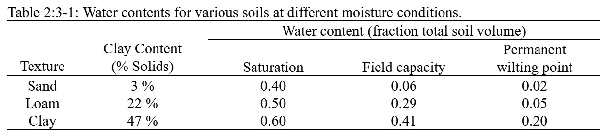

# 2:3.1 Soil Structure

Soil is comprised of three phases—solid, liquid and gas. The solid phase consists of minerals and/or organic matter that forms the matrix or skeleton of the soil. Between the solid particles, soil pores are formed that hold the liquid and gas phases. The soil solution may fill the soil pores completely (saturated) or partially (unsaturated). When the soil is unsaturated, the soil solution is found as thin films along particle surfaces, as annular wedges around contact points of particles and as isolated bodies in narrow pore passages.

The soil’s bulk density defines the relative amounts of pore space and soil matrix. Bulk density is calculated:

$$\rho _b=\frac{M_s}{V_T}$$                                                                                                                                                                    2:3.1.1

where $$\rho _b$$ is the bulk density (Mg m$$^{-3}$$), $$M_s$$ is the mass of the solids (Mg), and $$V_T$$ is the total volume (m$$^3$$). The total volume is defined as

$$V_T=V_A+V_W+V_S$$                                                                                                                                           2:3.1.2

where $$V_A$$ is the volume of air (m$$^3$$), $$V_W$$ is the volume of water (m$$^3$$), and $$V_S$$ is the volume of solids (m$$^3$$). The relationship between soil porosity and soil bulk density is

$$\phi_{soil}=1-\frac{\rho_b}{\rho_s}$$                                                                                                                                                         2:3.1.3

where $$\phi_{soil}$$ is the soil porosity expressed as a fraction of the total soil volume, $$\rho_b$$ is the bulk density (Mg m$$^{-3}$$), and $$\rho_s$$ is the particle density (Mg m$$^{-3}$$). The particle density, or density of the solid fraction, is a function of the mineral composition of the soil matrix. Based on research, a default value of 2.65 Mg m$$^{-3}$$ is used for particle density.

Storage, transport and availability of soil solution and soil air are not nearly as dependent on the total amount of porosity as they are on the arrangement of pore space. Soil pores vary in size and shape due to textural and structural arrangement. Based on the diameter of the pore at the narrowest point, the pores may be classified as macropores (narrowest diameter > 100 $$\mu m$$), mesopores (narrowest diameter 30-100 $$\mu m$$), and micropores (narrowest diameter < 30 $$\mu m$$) (Koorevaar et al, 1983). Macropores conduct water only during flooding or ponding rain and drainage of water from these pores is complete soon after cessation of the water supply. Macropores control aeration and drainage processes in the soil. Mesopores conduct water even after macropores have emptied, e.g. during non-ponding rain and redistribution. Micropores retain soil solution or conduct it very slowly.

When comparing soils of different texture, clay soils contain a greater fraction of mesopores and micropores while sand soils contain mostly macropores. This is evident when the hydraulic conductivities of clay and sand soils are compared. The conductivity of a sand soil can be several orders of magnitude greater than that for a clay soil.

The water content of a soil can range from zero when the soil is oven dried to a maximum value ($$\phi_{soil}$$) when the soil is saturated. For plant-soil interactions, two intermediate stages are recognized: field capacity and permanent wilting point. Field capacity is the water content found when a thoroughly wetted soil has drained for approximately two days. Permanent wilting point is the water content found when plants growing in the soil wilt and do not recover if their leaves are kept in a humid atmosphere overnight. To allow these two stages to be quantified more easily, they have been redefined in terms of tensions at which water is held by the soil. Field capacity is the amount of water held in the soil at a tension of 0.033 MPa and the permanent wilting point is the amount of water held in the soil at a tension of 1.5 MPa. The amount of water held in the soil between field capacity and permanent wilting point is considered to be the water available for plant extraction.

Table 2:3-1 lists the water content for three soils as a fraction of the total volume for different moisture conditions. Note that the total porosity, given by the water content at saturation, is lowest for the sand soil and highest for the clay soil.

The sand soil drains more quickly than the loam and clay. Only 15% of the water present in the sand soil at saturation remains at field capacity. 58% of the water present at saturation in the loam remains at field capacity while 68% of the water present at saturation in the clay soil remains at field capacity. The reduction of water loss with increase in clay content is cause by two factors. As mentioned previously, clay soils contain more mesopores and micropores than sand soils. Also, unlike sand and silt particles, clay particles possess a net negative charge. Due to the polar nature of water molecules, clay particles are able to attract and retain water molecules. The higher water retention of clay soils is also seen in the fraction of water present at permanent wilting point. In the soils listed in Table 2:3-1, the volumetric water content of the clay is 0.20 at the wilting point while the sand and loam have a volumetric water content of 0.02 and 0.05 respectively.

The plant available water, also referred to as the available water capacity, is calculated by subtracting the fraction of water present at permanent wilting point from that present at field capacity.

$$AWC=FC-WP$$                                                                                                                                           2:3.1.4

where $$AWC$$ is the plant available water content, $$FC$$ is the water content at field capacity, and $$WP$$ is the water content at permanent wilting point. For the three soil textures listed in Table 2:3-1, the sand has an available water capacity of 0.04, the loam has an available water capacity of 0.24 and the clay has an available water capacity of 0.21. Even though the clay contains a greater amount of water than the loam at all three tensions, the loam has a larger amount of water available for plant uptake than the clay. This characteristic is true in general.

SWAT+ estimates the permanent wilting point volumetric water content for each soil layer as:

$$WP_{ly}=0.40*\frac{m_c*\rho_b}{100}$$                                                                                                                                           2:3.1.5

where $$WP_{ly}$$ is the water content at wilting point expressed as a fraction of the total soil volume, $$m_c$$ is the percent clay content of the layer(%),and$$\rho_b$$ is the bulk density for the soil layer(Mg m$$^{-3}$$). Field capacity water content is estimated

$$FC_{ly}=WP_{ly}+AWC_{ly}$$                                                                                                                                   2:3.1.6

where $$FC_{ly}$$ is the water content at field capacity expressed as a fraction of the total soil volume, $$WP_{ly}$$ is the water content at wilting point expressed as a fraction of the total soil volume, and $$AWC_{ly}$$ is the available water capacity of the soil layer expressed as a fraction of the total soil volume. $$AWC_{ly}$$ is input by the user.

Water in the soil can flow under saturated or unsaturated conditions. In saturated soils, flow is driven by gravity and usually occurs in the downward direction. Unsaturated flow is caused by gradients arising due to adjacent areas of high and low water content. Unsaturated flow may occur in any direction.

SWAT+ directly simulates saturated flow only. The model records the water contents of the different soil layers but assumes that the water is uniformly distributed within a given layer. This assumption eliminates the need to model unsaturated flow in the horizontal direction. Unsaturated flow between layers is indirectly modeled with the depth distribution of plant water uptake (equation 5:2.2.1) and the depth distribution of soil water evaporation (equation 2:2.3.16).

Saturated flow occurs when the water content of a soil layer surpasses the field capacity for the layer. Water in excess of the field capacity water content is available for percolation, lateral flow or tile flow drainage unless the temperature of the soil layer is below 0°C. When the soil layer is frozen, no water movement is calculated.

Table 2:3-1: SWAT+ input variables used in percolation calculations.

| Definition                                   | Source Name | Input Name | Input File |
| -------------------------------------------- | ----------- | ---------- | ---------- |
| $$m_c$$: Percent clay content                | CLAY        |            | .sol       |
| $$\rho_b$$: Bulk density     (Mg m$$^{-3}$$) | SOL\_BD     |            | .sol       |
| $$AWC_{ly}$$: available water capacity       | SOL\_AWC    |            | .sol       |
