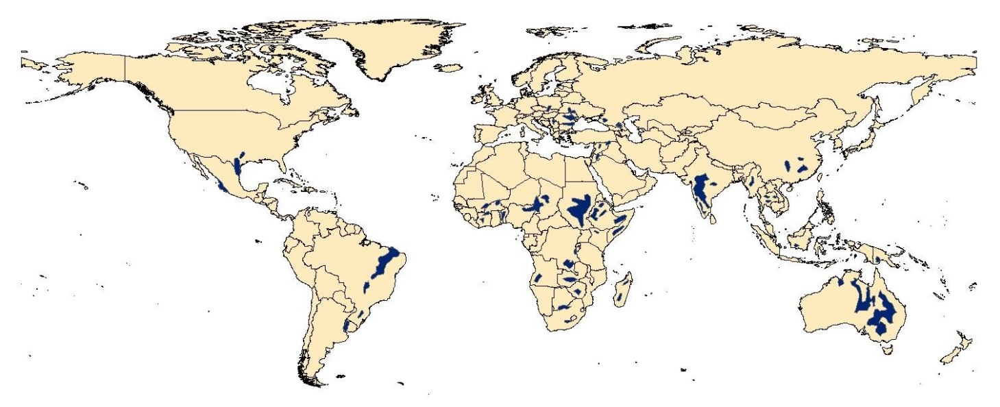
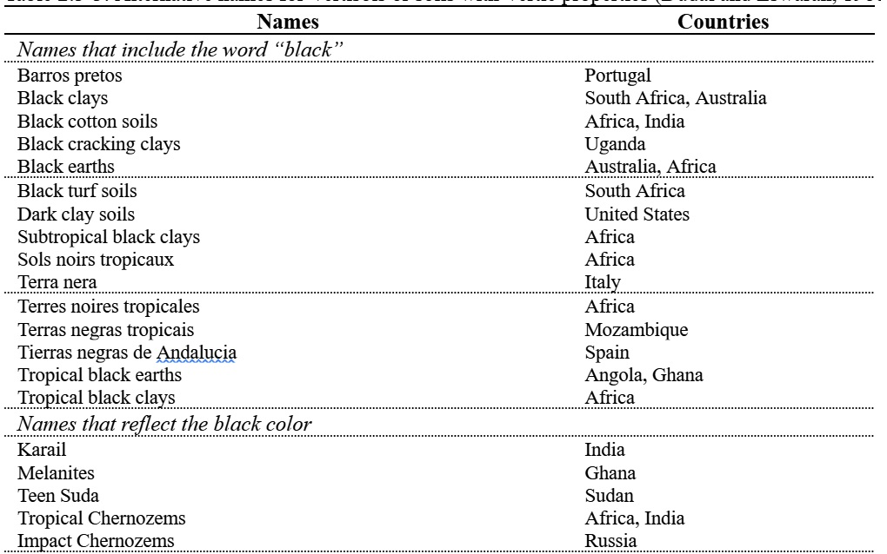
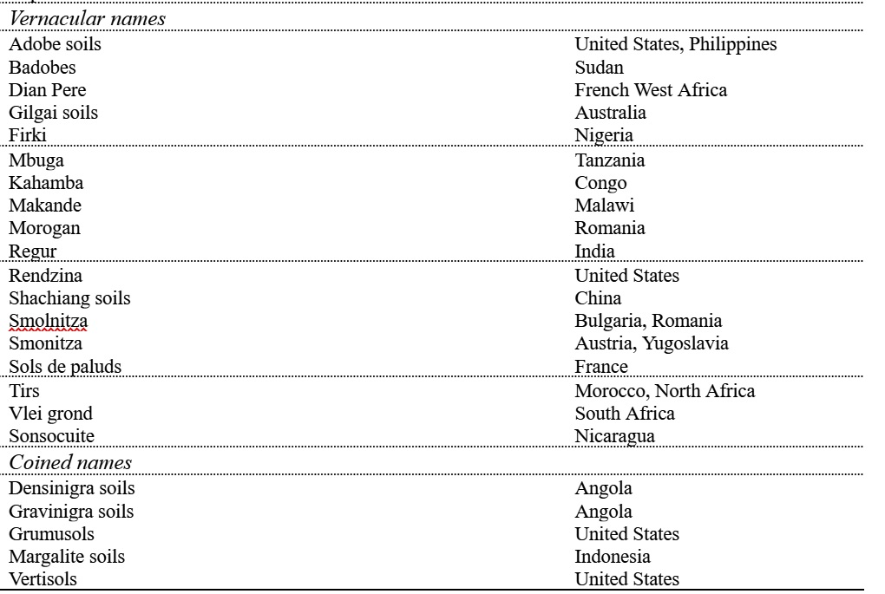
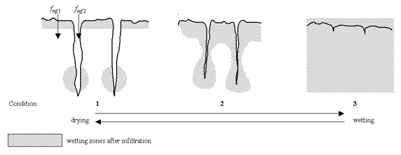

# 2:3.3 Bypass Flow

One of the most unique soil orders is the Vertisols. These soils are characterized by a propensity to shrink when dried and swell when moistened. When the soil is dry, large cracks form at the soil surface. This behavior is a result of the type of soil material present and the climate. Vertisols contain at least 30% clay with the clay fraction dominated by smectitic mineralogy and occur in areas with cyclical wet and dry periods.

Vertisols are found worldwide (Figure 2:3-1). They have a number of local names, some of which are listed in Table 2:3-3.

<figure><figcaption>
Figure 2:3-1: Soil associations of Vertisols (After Dudal and Eswaran, 1988)
</figcaption></figure>

Table 2:3-3: Alternative names for Vertisols or soils with Vertic properties (Dudal and Eswaran, 1988).

<figure><figcaption></figcaption></figure>

<figure><figcaption></figcaption></figure>

One criteria used to classify a soil as a Vertisol is the formation of shrinkage cracks in the dry season that penetrate to a depth of more than 50 cm and are at least 1 cm wide at 50 cm depth. The cracks can be considerably wider at the surface—30 cm cracks at the surface are not unusual although 6-15 cm cracks are more typical.

To accurately predict surface runoff and infiltration in areas dominated by soils that exhibit Vertic properties, the temporal change in soil volume must be quantified. Bouma and Loveday (1988) identified three soil moisture conditions for which infiltration needs to be defined (Figure 2:3-2).

<figure><figcaption>
Figure 2:3-2: Diagram showing the effect of wetting and drying on cracking in Vertisols (After Bouma and Loveday, 1988)
</figcaption></figure>

Traditional models of infiltration are applicable to soils in which cracks have been closed by swelling and the soil acts as a relatively homogenous porous medium (Condition 3 in Figure 2:3-2). Condition 1 in Figure 2:3-2 represents the driest state with cracks at maximum width, a condition present at the end of the dry season/beginning of the rainy season. Condition 2 in Figure 2:3-2 represents the crack development typical with an actively growing crop requiring multiple irrigation or rainfall events to sustain growth. Bypass flow, the vertical movement of free water along macropores through unsaturated soil horizons, will occur in conditions 1 and 2. Bypass flow (finf,2 in Figure 2:3-2) occurs when the rate of rainfall or irrigation exceeds the vertical infiltration rate into the soil peds (finf,1 in Figure 2:3-2).

When bypass flow is modeled, SWAT+ calculates the crack volume of the soil matrix for each day of simulation by layer. On days in which precipitation events occur, infiltration and surface runoff is first calculated for the soil peds (finf,1 in Figure 2:3-2) using the curve number or Green & Ampt method. If any surface runoff is generated, it is allowed to enter the cracks. A volume of water equivalent to the total crack volume for the soil profile may enter the profile as bypass flow. Surface runoff in excess of the crack volume remains overland flow.

Water that enters the cracks fills the soil layers beginning with the lowest layer of crack development. After cracks in one layer are filled, the cracks in the overlying layer are allowed to fill.

The crack volume initially estimated for a layer is calculated:

$$crk_{ly,i}=crk_{max,ly}*\frac{coef_{crk}*FC_{ly}-SW_{ly}}{coef_{crk}*FC_{ly}}$$                                                                                                            2:3.3.1

where $$crk_{ly,i}$$ is the initial crack volume calculated for the soil layer on a given day expressed as a depth (mm), $$crk_{max,ly}$$ is the maximum crack volume possible for the soil layer (mm), $$coef_{crk}$$ is an adjustment coefficient for crack flow, $$FC_{ly}$$ is the water content of the soil layer at field capacity (mm H$$_2$$O), and $$SW_{ly}$$ is the water content of the soil layer on a given day (mm H$$_2$$O). The adjustment coefficient for crack flow, $$coef_{crk}$$, is set to 0.10.

When the moisture content of the entire profile falls below 90% of the field capacity water content for the profile during the drying stage, the crack volume for a given day is a function of the crack volume estimated with equation 2:3.3.1 and the crack volume of the layer on the previous day. When the soil is wetting and/or when the moisture content of the profile is above 90% of the field capacity water content, the crack volume for a given day is equal to the volume calculated with equation 2:3.3.1.

$$crk_{ly}=\ell_{crk}*crk_{ly,d-1}+(1.0-\ell_{crk})*crk_{ly,i}$$&#x20;

&#x20;when    $$SW<0.90*FC$$ and $$crk_{ly,i} > crk_{ly,d-1}$$                                                                                    2:3.3.2

$$crk_{ly}=crk_{ly,i}$$ when $$SW \ge 0.90*FC$$ or $$crk_{ly,i} \le crk_{ly,d-1}$$                                                             2:3.3.3

where $$crk_{ly}$$ is the crack volume for the soil layer on a given day expressed as a depth (mm), $$\ell_{crk}$$ is the lag factor for crack development during drying, $$crk_{ly,d-1}$$ is the crack volume for the soil layer on the previous day (mm), $$crk_{ly,i}$$ is the initial crack volume calculated for the soil layer on a given day using equation 2:3.3.1 (mm), $$SW$$ is the water content of the soil profile on a given day (mm H$$_2$$O), and $$FC$$ is the water content of the soil profile at field capacity (mm H$$_2$$O).

&#x20;      As the tension at which water is held by the soil particles increases, the rate of water diffusion slows. Because the rate of water diffusion is analogous to the coefficient of consolidation in classical consolidation theory (Mitchell, 1992), the reduction in diffusion will affect crack formation. The lag factor is introduced during the drying stage to account for the change in moisture redistribution dynamics that occurs as the soil dries. The lag factor, $$\ell_{crk}$$, is set to a value of 0.99.

The maximum crack volume for the layer, $$crk_{max,ly}$$, is calculated:

$$crk_{max,ly}=0.916*crk_{max}*exp\lfloor-0.0012*z_{l,ly}\rfloor*depth_{ly}$$                                                            2:3.3.4

where $$crk_{max,ly}$$ is the maximum crack volume possible for the soil layer (mm), $$crk_{max}$$ is the potential crack volume for the soil profile expressed as a fraction of the total volume, $$z_{l,ly}$$ is the depth from the soil surface to the bottom of the soil layer (mm), and $$depth_{ly}$$ is the depth of the soil layer (mm). The potential crack volume for the soil profile, $$crk_{max}$$, is input by the user. Those needing information on the measurement of this parameter are referred to Bronswijk (1989; 1990).

Once the crack volume for each layer is calculated, the total crack volume for the soil profile is determined.

$$crk=\sum^n_{ly=1} crk_{ly}$$                                                                                                                                               2:3.3.5

where $$crk$$ is the total crack volume for the soil profile on a given day (mm), $$crk_{ly}$$ is the crack volume for the soil layer on a given day expressed as a depth (mm), $$ly$$ is the layer, and $$n$$ is the number of layers in the soil profile.

After surface runoff is calculated for rainfall events using the curve number or Green & Ampt method, the amount of runoff is reduced by the volume of cracks present that day:

$$Q_{surf}=Q_{surf,i}-crk$$   if $$Q_{surf,i}>crk$$                                                                                                      2:3.3.6

$$Q_{surf}=0$$                        if $$Q_{surf,i} \le crk$$                                                                                                         2:3.3.7

where $$Q_{surf}$$ is the accumulated runoff or rainfall excess for the day (mm H$$_2$$O), $$Q_{surf,i}$$ is the initial accumulated runoff or rainfall excess determined with the Green & Ampt or curve number method (mm H$$_2$$O), and $$crk$$ is the total crack volume for the soil profile on a given day (mm). The total amount of water entering the soil is then calculated:&#x20;

$$w_{inf}=R_{day}-Q_{surf}$$                                                                                                                                          2:3.3.8

where $$w_{inf}$$ is the amount of water entering the soil profile on a given day (mm H$$_2$$O), $$R_{day}$$ is the rainfall depth for the day adjusted for canopy interception (mm H$$_2$$O), and $$Q_{surf}$$ is the accumulated runoff or rainfall excess for the day (mm H$$_2$$O).

Bypass flow past the bottom of the profile is calculated:

$$w_{crk,btm}=0.5*crk*(\frac{crk_{ly=nn}}{depth_{ly=nn}})$$                                                                                                                   2:3.3.9

where $$w_{crk,btm}$$ is the amount of water flow past the lower boundary of the soil profile due to bypass flow (mm H$$_2$$O), $$crk$$ is the total crack volume for the soil profile on a given day (mm), $$crk_{ly=nn}$$ is the crack volume for the deepest soil layer ($$ly=nn$$) on a given day expressed as a depth (mm), and $$depth_{ly=nn}$$ is the depth of the deepest soil layer ($$ly=nn$$) (mm).

After $$w_{crk,btm}$$ is calculated, each soil layer is filled to field capacity water content beginning with the lowest layer and moving upward until the total amount of water entering the soil, $$w_{inf}$$, has been accounted for.&#x20;

Table 2:3-4: SWAT+ input variables used in bypass flow calculations.

| Definition                                                        | Source Name | Input Name | Input File |
| ----------------------------------------------------------------- | ----------- | ---------- | ---------- |
| Bypass flow code: 0-do not model bypass flow; 1-model bypass flow | ICRK        |            | .bsn       |
| $$crk_{max}$$: Potential crack volume for soil profile            | SOL\_CRK    |            | .sol       |
