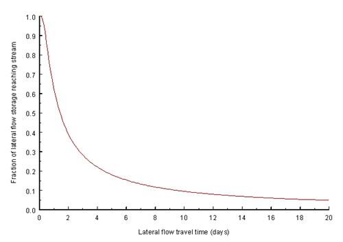

# 2:3.4.1 Lateral Flow Lag

In large subbasins with a time of concentration greater than 1 day, only a portion of the lateral flow will reach the main channel on the day it is generated. SWAT+ incorporates a lateral flow storage feature to lag a portion of lateral flow release to the main channel.

Once lateral flow is calculated, the amount of lateral flow released to the main channel is calculated:

$$Q_{lat}=(Q'_{lat}+Q_{latstor,i-1})*(1-exp[\frac{-1}{TT_{lag}}])$$                                                                                        2:3.5.10

where $$Q_{lat}$$ is the amount of lateral flow discharged to the main channel on a given day (mm H$$_2$$O),$$Q'_{lat}$$ is the amount of lateral flow generated in the subbasin on a given day (mm H$$_2$$O), $$Q_{latstor,i-1}$$ is the lateral flow stored or lagged from the previous day (mm H$$_2$$O), and $$TT_{lag}$$ is the lateral flow travel time (days).

The model will calculate lateral flow travel time or utilize a user-defined travel time. In the majority of cases, the user should allow the model to calculate the travel time. If drainage tiles are present in the HRU, lateral flow travel time is calculated:

$$TT_{lag}=\frac{tile_{lag}}{24}$$                                                                                                                                                       2:3.5.11

where $$TT_{lag}$$ is the lateral flow travel time (days) and $$tile_{lag}$$ is the drain tile lag time (hrs). In HRUs without drainage tiles, lateral flow travel time is calculated:

&#x20;$$TT_{lag}=10.4*\frac{L_{hill}}{K_{sat,mx}}$$                                                                                                                                       2:3.5.12

where $$TT_{lag}$$ is the lateral flow travel time (days), $$L_{hill}$$ is the hillslope length (m), and $$K_{sat,mx}$$ is the highest layer saturated hydraulic conductivity in the soil profile (mm/hr).

The expression $$(1-exp[\frac{-1}{TT_{lag}}])$$ in equation 2:3.5.10 represents the fraction of the total available water that will be allowed to enter the reach on any one day. Figure 2:3-5 plots values for this expression at different values of $$TT_{lag}$$.

<figure><figcaption>
Figure 2:3-5: Influence of TT_{lag} on fraction of lateral flow released.
</figcaption></figure>

The delay in release of lateral flow will smooth the streamflow hydrograph simulated in the reach.

Table 2:3-6: SWAT+ input variables used in lateral flow calculations.

| Definition                                            | Source Name | Input Name | Input File |
| ----------------------------------------------------- | ----------- | ---------- | ---------- |
| $$L_{hill}$$: Hillslope length (m)                    | SLSOIL      |            | .hru       |
| $$K_{sat}$$: Saturated hydraulic conductivity (mm/hr) | SOL\_K      |            | .sol       |
| $$slp$$: Average slope of the subbasin (m/m)          | HRU\_SLP    |            | .hru       |
| $$TT_{lag}$$: Lateral flow travel time (days)         | LAT\_TTIME  |            | .mgt       |
| $$tile_{lag}$$: Drain tile lag time (hrs)             | GDRAIN      |            | .mgt       |
