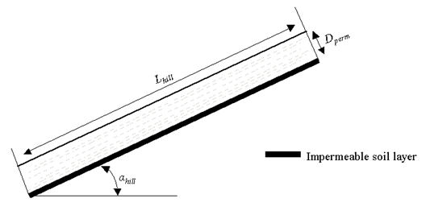
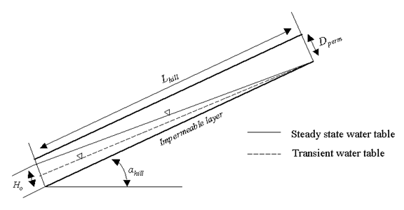

# 2:3.5 Lateral Flow

Lateral flow will be significant in areas with soils having high hydraulic conductivities in surface layers and an impermeable or semipermeable layer at a shallow depth. In such a system, rainfall will percolate vertically until it encounters the impermeable layer. The water then ponds above the impermeable layer forming a saturated zone of water, i.e. a perched water table. This saturated zone is the source of water for lateral subsurface flow.

SWAT+ incorporates a kinematic storage model for subsurface flow developed by Sloan et al. (1983) and summarized by Sloan and Moore (1984). This model simulates subsurface flow in a two-dimensional cross-section along a flow path down a steep hillslope. The kinematic approximation was used in its derivation.

This model is based on the mass continuity equation, or mass water balance, with the entire hillslope segment used as the control volume. The hillslope segment has a permeable soil surface layer of depth $$D_{perm}$$ and length $$L_{hill}$$ with an impermeable soil layer or boundary below it as shown in Figure 2:3-3. The hillslope segment is oriented at an angle αhill to the horizontal.

<figure><figcaption>
Figure 2:3-3: Conceptual representation of the hillslope segment.
</figcaption></figure>

The kinematic wave approximation of saturated subsurface or lateral flow assumes that the lines of flow in the saturated zone are parallel to the impermeable boundary and the hydraulic gradient equals the slope of the bed.

<figure><figcaption>
Figure 2:3-4: Behavior of the water table as assumed in the kinematic storage model.
</figcaption></figure>

From Figure 2:3-4, the drainable volume of water stored in the saturated zone of the hillslope segment per unit area, $$SW_{ly,excess}$$, is

$$SW_{ly,excess}=\frac{1000*H_o*\phi_d*L_{hill}}{2}$$                                                                                                                                   2:3.5.1

where $$SW_{ly,excess}$$ is the drainable volume of water stored in the saturated zone of the hillslope per unit area (mm H$$_2$$O), $$H_o$$ is the saturated thickness normal to the hillslope at the outlet expressed as a fraction of the total thickness (mm/mm), $$\phi_d$$ is the drainable porosity of the soil (mm/mm), $$L_{hill}$$ is the hillslope length (m), and 1000 is a factor needed to convert meters to millimeters. This equation can be rearranged to solve for $$H_o$$:&#x20;

&#x20;$$H_o=\frac{2*SW_{ly,excess}}{1000*\phi_d*L_{hill}}$$                                                                                                                                                 2:3.5.2

The drainable porosity of the soil layer is calculated:

$$\phi_d=\phi_{soil}-\phi_{fc}$$                                                                                                                                                   2:3.5.3

where $$\phi_d$$ is the drainable porosity of the soil layer (mm/mm), $$\phi_{soil}$$ is the total porosity of the soil layer (mm/mm), and $$\phi_{fc}$$ is the porosity of the soil layer filled with water when the layer is at field capacity water content (mm/mm).

A soil layer is considered to be saturated whenever the water content of the layer exceeds the layer’s field capacity water content. The drainable volume of water stored in the saturated layer is calculated:

$$SW_{ly,excess}=SW_{ly}-FC_{ly}$$  if $$SW_{ly}> FC_{ly}$$                                                                                          2:3.5.4

$$SW_{ly,excess}=0$$                        if $$SW_{ly} \le FC_{ly}$$                                                                                             2:3.5.5

where $$SW_{ly}$$ is the water content of the soil layer on a given day (mm H$$_2$$O) and $$FC_{ly}$$ is the water content of the soil layer at field capacity (mm H$$_2$$O).

The net discharge at the hillslope outlet, $$Q_{lat}$$, is given by

$$Q_{lat}=24*H_o*v_{lat}$$                                                                                                                                          2:3.5.6

where $$Q_{lat}$$ is the water discharged from the hillslope outlet (mm H$$_2$$O/day), $$H_o$$ is the saturated thickness normal to the hillslope at the outlet expressed as a fraction of the total thickness (mm/mm), $$v_{lat}$$ is the velocity of flow at the outlet (mm h$$^{-1}$$), and 24 is a factor to convert hours to days.

Velocity of flow at the outlet is defined as

$$v_{lat}=K_{sat}*sin(\alpha_{hill})$$                                                                                                                                      2:3.5.7

where $$K_{sat}$$ is the saturated hydraulic conductivity (mm h$$^{-1}$$) and $$\alpha_{hill}$$ is the slope of the hillslope segment. The slope is input to SWAT+ as the increase in elevation per unit distance ($$slp$$) which is equivalent to  $$^{tan(\alpha_{hill})}$$. Because $$^{tan(\alpha_{hill}) \cong sin(\alpha_{hill})}$$ , equation 2:3.5.3 is modified to use the value for the slope as input to the model:

&#x20;$$v_{lat}=K_{sat}*tan(\alpha_{hill})=K_{sat}*slp$$                                                                                                          2:3.5.8

Combining equations 2:3.5.2 and 2:3.5.8 with equation 2:3.5.6 yields the equation

$$Q_{lat}=0.024*(\frac{2*SW_{ly,excess}*K_{sat}*slp}{\phi_d*L_{hill}})$$                                                                                                               2:3.5.9

where all terms are previously defined.
