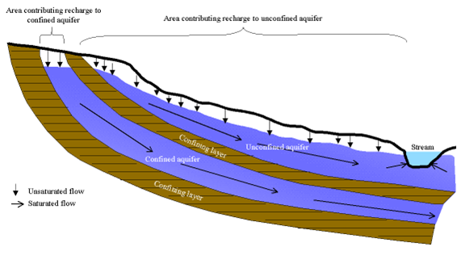
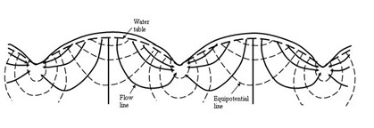
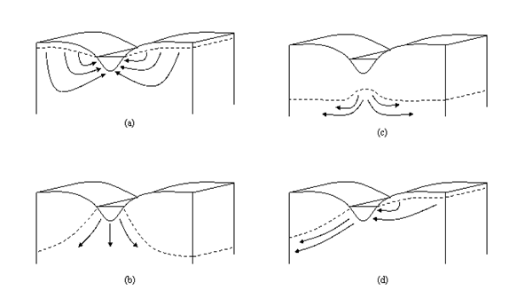

# 2:4.1 Groundwater Systems

Within the saturated zone of groundwater, regions of high conductivity and low conductivity will be found. The regions of high conductivity are made up of coarse-grained particles with a large percentage of macropores that allow water to move easily. The regions of low conductivity are made up of fine-grained particles with a large percentage of mesopores and micropores that restrict the rate of water movement.

An aquifer is “a geologic unit that can store enough water and transmit it at a rate fast enough to be hydrologically significant” (Dingman, 1994). An unconfined aquifer is an aquifer whose upper boundary is the water table. A confined aquifer is an aquifer bounded above and below by geologic formations whose hydraulic conductivity is significantly lower than that of the aquifer. Figure 2:4-1 illustrates the two types of aquifers.

<figure><figcaption>
 Figure 2:4-1: Unconfined and confined aquifers (After Dingman, 1994).
</figcaption></figure>

Recharge to unconfined aquifers occurs via percolation to the water table from a significant portion of the land surface. In contrast, recharge to confined aquifers by percolation from the surface occurs only at the upstream end of the confined aquifer, where the geologic formation containing the aquifer is exposed at the earth’s surface, flow is not confined, and a water table is present.

Topography exerts an important influence on groundwater flow. The flow of groundwater in an idealized hilly upland area is depicted in Figure 2:4-2. The landscape can be divided into areas of recharge and areas of discharge. A recharge area is defined as a portion of a drainage basin where ground water flow is directed away from the water table. A discharge area is defined as a portion of the drainage basin where ground water flow is directed toward the water table. The water table is at or near the surface in discharge areas and surface water bodies are normally located in discharge areas.

<figure><figcaption>
Figure 2:4-2: Groundwater flow net in an idealized hilly region with homogenous permeable material resting on an impermeable base (After Hubbert, 1940)
</figcaption></figure>

Streams may be categorized by their relationship to the groundwater system. A stream located in a discharge area that receives groundwater flow is a gaining or effluent stream (Figure 2:4-3a). This type of stream is characterized by an increase in discharge downstream. A stream located in a recharge area is a losing or influent stream. This type of stream is characterized by a decrease in discharge downstream. A losing stream may be connected to (Figure 2:4-3b) or perched above (Figure 2:4-3c) the groundwater flow area. A stream that simultaneously receives and loses groundwater is a flow-through stream (Figure 2:4-3d)

<figure><figcaption>
Figure 2:4-3: Stream-groundwater relationships: a) gaining stream receiving water from groundwater flow; b) losing stream connected to groundwater system; c) losing stream perched above groundwater system; and d) flow-through stream (After Dingman, 1994).
</figcaption></figure>

SWAT+ simulates two aquifers in each subbasin. The shallow aquifer is an unconfined aquifer that contributes to flow in the main channel or reach of the subbasin. The deep aquifer is a confined aquifer. Water that enters the deep aquifer is assumed to contribute to streamflow somewhere outside of the watershed (Arnold et al., 1993).
