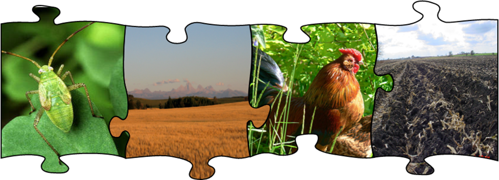

# Section 3: Nutrients/Pesticides

<figure><figcaption></figcaption></figure>

The fate and transport of nutrients and pesticides in a watershed depend on the transformations the compounds undergo in the soil environment. SWAT+ models the complete nutrient cycle for nitrogen and phosphorus as well as the degradation of any pesticides applied in an HRU.

The following five chapters review the methodology used by SWAT+ to simulate nutrient, pesticide, bacteria, and carbon processes in the soil.
