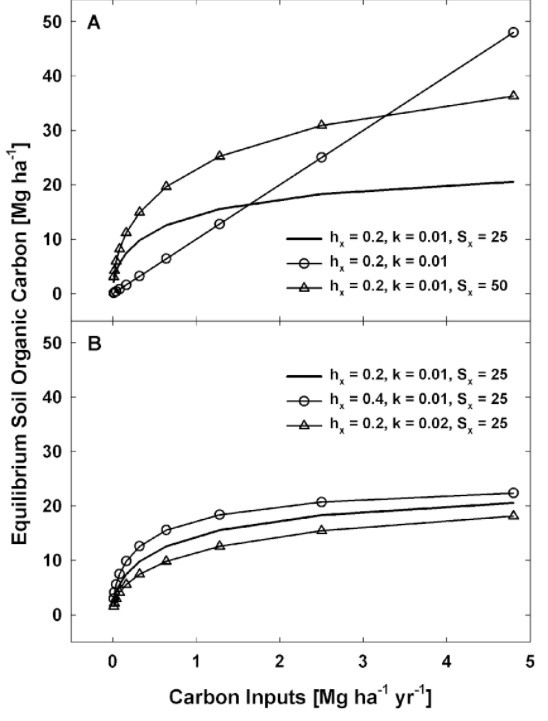

# Analytical Solutions

The balanced equation for $$S_C$$ in a single layer (Eq. \[3:5.1.2a]) can be combined with Eq. \[3:5.1.3a] and Eq. \[3:5.1.7] and with a few assumptions allow for an analytical solution to the differential equation. The soil clay content and the C input rate were assumed to be constant and the powers $$\alpha$$ and $$\beta$$ set to 1, so that the balance equation can be solved explicitly for $$S_C$$. The time step was considered to be a year and we assumed that residues and manure fully decompose in that time frame so that $$k_R=k_M=1$$. Since the influence of residues and manure on the $$S_C$$ balance is similar we assumed that C inputs are only through residues. With these substitutions Eq. \[3:5.1.2a] becomes:

&#x20;           $$\frac{dS_C}{dt}=h_xR_C-\frac{h_xR_C}{S_x}S_C-\frac{k}{S_x}S^2_C$$                                                          3:5.3.1

The constant k substitutes for $$k_xf_Ef_{tool}$$. This differential equation can be solved analytically, with integration rendering the following solution:

&#x20;         $$S_C(t)=\frac{h_xR_C}{2k}[(\frac{\phi e^{\frac{\gamma_t}{S_x}}-1}{\phi e^{\frac{\gamma _t}{S_x}}+1})\sqrt{1+\frac{4kS_x}{h_xR_C}}-1]$$                                             3:5.3.2

&#x20;          $$\gamma=h_xR_C\sqrt{1+\frac{4kS_x}{h_xR_C}},$$

&#x20;           $$\phi=-\frac{2kS_C(t=0)+h_xR_C+\gamma}{2kS_C(t=0)+h_xR_C-\gamma}$$

The integration constant $$\phi$$ depends on the initial $$S_C$$. The steady state solution for Eq. 3:5.3.2 is:

&#x20;              $$S_C=\frac{h_xR_C}{2k}\sqrt{1+\frac{4kS_x}{h_xR_C}}-1]$$                                                             3:5.3.3

The ratio $$\frac{h_xR_C}{k}$$ is the equilibrium $$S_C$$ that would be obtained if neither $$h_C$$ nor $$k_S$$ had a dependence on $$S_C$$. As $$R_C$$ increases, the value of the fraction $$\frac{4kS_x}{h_xR_C}$$ will get smaller. Therefore, the squared root term in Eq. 3:5.3.3 can be approximated as $$1+\frac{1}{2}\frac{4kS_x}{h_xR_C}$$ by preserving just the first two terms of the binomial expansion, from which Eq. 3:5.3.4 can be re-written as:

&#x20;           $$S_C=\frac{h_xR_C}{2k}(1+(\frac{1}{2})\frac{4kS_x}{h_xR_C}-1)=S_x$$                                                 3:5.3.4

Therefore, as $$R_C$$ increases $$S_C$$ approaches $$S_x$$ asymptotically (Figure 1). Taking as a reference a soil layer with $$S_x$$ = 25 Mg C ha$$^{-1}$$, $$h_x$$ = 0.2, and $$k=0.01$$ $$y^{-1}$$, it can be seen in Figure 1 that doubling $$h_x$$ and $$k$$ have a similar effect but of opposite sign such that the equilibrium $$S_C$$ increases with increasing $$h_x$$ and decreases with increasing $$k$$. In both cases the increase and the decrease in $$S_C$$ are less than proportional to the increase in these two parameters. The equilibrium $$S_C$$, however, is very sensitive to changes in $$S_x$$, which makes this variable critical for a correct representation of $$S_C$$ dynamics. This formulation is a mathematical representation of the concept of $$S_C$$ saturation (Hassink and Whitmore, 1997; Six et al., 2002), enhanced with a control of the decomposition rate by $$S_C$$.

&#x20;            The transient trajectory of $$S_C$$ is controlled by the quotient of the two exponential terms in Eq. \[3:5.3.5].

&#x20;                $$d=1-\frac{\sum^N_{i=1}(O_i-S_i)^2}{\sum^N_{i=1}(|S_i-\overline O|+|O_i-\overline O|)^2}$$                                               \[3.5.3.5]

For a given $$S_x$$ and initial $$S_C$$, increasing the inputs ($$R_C$$) changes the steady state $$S_C$$ with decreasing marginal increments as $$S_C$$ approaches $$S_x$$, yet the steady state condition is approached faster with higher inputs (Figure 3:5-1). For a given $$R_C$$, changing $$S_x$$ has a substantial impact on the rate of change of $$S_C$$ when the inputs are medium to high (Figure 3:5-1) but a minor effect if inputs are too low. This formulation strongly suggests that soils with higher carbon storage capacity (higher $$S_x$$) that are currently depleted of $$S_C$$ should be the primary targets for storing $$S_C$$, or that soils with low $$S_x$$ may store carbon quickly for a few years but the rate of gains will decrease earlier than in soils with higher $$S_x$$.

&#x20;          The conditions for which the $$S_C$$ can be modeled analytically as shown here are very restrictive. The numerical solution implemented in the model is more flexible as the constants $$\alpha$$ and $$\beta$$ are allowed to differ from 1. The model can be expanded to accommodate saturation of different SOM pools, instead of just one uniform pool, as strongly suggested by the results and analysis of Stewart et al. (2008). Yet, this will require a level of parameterization for which we consider there is simply not sufficient information for a realistic implementation in numerical models.

&#x20;           Figure 3:5-1. Equilibrium soil organic carbon (SC, Mg C ha$$^{-1}$$) for the steady state condition (Eq. \[3:5.3.3]) with different values for humification ($$h_x$$, kg kg$$^{-1}$$), SOM apparent turnover rate ($$k$$, yr$$^{-1}$$), and saturation soil organic carbon ($$S_{CC}$$, Mg C ha$$^{-1}$$). The line without a symbol in both panels was arbitrarily chosen as a reference. The linear, no asymptotic line in Panel A shows the equilibrium for the case in which $$h_x$$ and $$k$$ do not depend on $$S_C$$ so that $$S_C$$ at equilibrium = $$h_xR_C/k$$, where $$R_C$$ is the residue carbon input rate (Mg C ha$$^{-1}$$ yr$$^{-1}$$). Panel A shows the equilibrium when $$S_{CC}$$ is doubled and Panel B shows the equilibrium $$S_C$$ when $$h_x$$ or $$k$$ is doubled.
