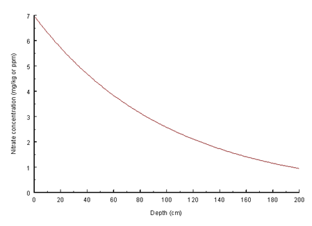

# 3:1.1.1 Initialization of Soil Nitrogen Levels

Users may define the amount of nitrate and organic nitrogen contained in humic substances for all soil layers at the beginning of the simulation. If the user does not specify initial nitrogen concentrations, SWAT+ will initialize levels of nitrogen in the different pools.

Initial nitrate levels in the soil are varied by depth using the relationship:

$$NO3_{conc,z}=7*exp(\frac{-z}{1000})$$                                                                                                                                 3:1.1.1

where $$NO3_{conc,z}$$ is the concentration of nitrate in the soil at depth $$z$$ (mg/kg or ppm), and $$z$$ is the depth from the soil surface (mm). The nitrate concentration with depth calculated from equation 3:1.1.1 is displayed in Figure 3:1-3. The nitrate concentration for a layer is calculated by solving equation 3:1.1.1 for the horizon’s lower boundary depth.

&#x20;Organic nitrogen levels are assigned assuming that the C:N ratio for humic materials is 14:1. The concentration of humic organic nitrogen in a soil layer is calculated:

$$orgN_{hum,ly}=10^4*(\frac{orgC_{ly}}{14})$$                                                                                                                              3:1.1.2

where $$orgN_{hum,ly}$$ is the concentration of humic organic nitrogen in the layer (mg/kg or ppm), and $$orgC_{ly}$$ is the amount of organic carbon in the layer (%). The humic organic $$N$$ is partitioned between the active and stable pools using the following equations:

$$orgN_{act,ly}=orgN_{hum,ly}*fr_{actN}$$                                                                                                                   3.1.1.3

$$orgN_{sta,ly}=orgN_{hum,ly}*(1-fr_{actN})$$                                                                                                       3:1.1.4

where $$orgN_{act,ly}$$ is the concentration of nitrogen in the active organic pool (mg/kg), $$orgN_{hum,ly}$$ is the concentration of humic organic nitrogen in the layer (mg/kg), $$fr_{actN}$$ is the fraction of humic nitrogen in the active pool, and $$orgN_{sta,ly}$$ is the concentration of nitrogen in the stable organic pool (mg/kg). The fraction of humic nitrogen in the active pool, $$fr_{actN}$$, is set to 0.02.

Nitrogen in the fresh organic pool is set to zero in all layers except the top 10 mm of soil. In the top 10 mm, the fresh organic nitrogen pool is set to 0.15% of the initial amount of residue on the soil surface.

$$orgN_{frsh,surf}=0.0015*rsd_{surf}$$                                                                                                                   3:1.1.5

where $$orgN_{frsh,surf}$$ is the nitrogen in the fresh organic pool in the top 10 mm (kg N/ha), and $$rsd_{surf}$$ is material in the residue pool for the top 10 mm of soil (kg/ha).

The ammonium pool for soil nitrogen, $$NH4_{ly}$$, is initialized to 0 ppm.

While SWAT+ allows nutrient levels to be input as concentrations, it performs all calculations on a mass basis. To convert a concentration to a mass, the concentration is multiplied by the bulk density and depth of the layer and divided by 100:

$$\frac{conc_N*\rho_b*depth_{ly}}{100}=\frac{kgN}{ha}$$                                                                                                                                           3:1.1.6

where $$conc_N$$ is the concentration of nitrogen in a layer (mg/kg or ppm), $$\rho_b$$ is the bulk density of the layer (Mg/m$$^3$$), and $$depth_{ly}$$ is the depth of the layer (mm).

Table 3:1-1: SWAT+ input variables that pertain to nitrogen pools.

| Definition                                                                      | Source Name | Input Name | Input File |
| ------------------------------------------------------------------------------- | ----------- | ---------- | ---------- |
| $$NO3_{conc,ly}$$: Initial NO3 concentration in soil layer (mg/kg or ppm)       | SOL\_NO3    |            | .chm       |
| $$orgN_{hum,ly}$$: Initial humic organic nitrogen in soil layer (mg/kg or ppm)  | SOL\_ORGN   |            | .chm       |
| $$rsd_{surf}$$: Material in the residue pool for the top 10mm of soil (kg ha-1) | RSDIN       |            | .hru       |
| $$\rho_b$$: Bulk density of the layer (Mg/m$$^3$$)                              | SOL\_BD     |            | .sol       |
| $$orgC_{ly}$$: Amount of organic carbon in the layer (%)                        | SOL\_CBN    |            | .sol       |
