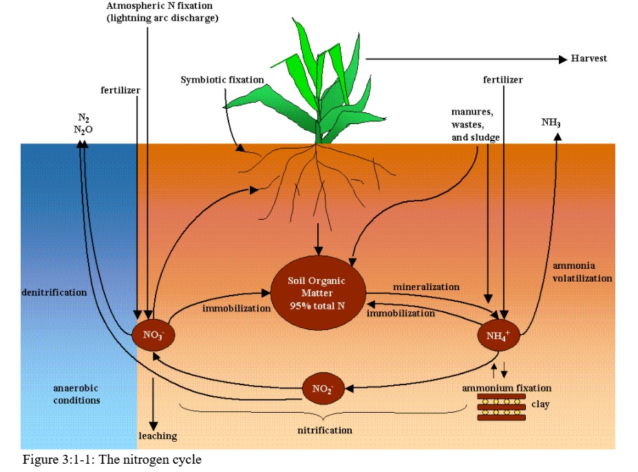
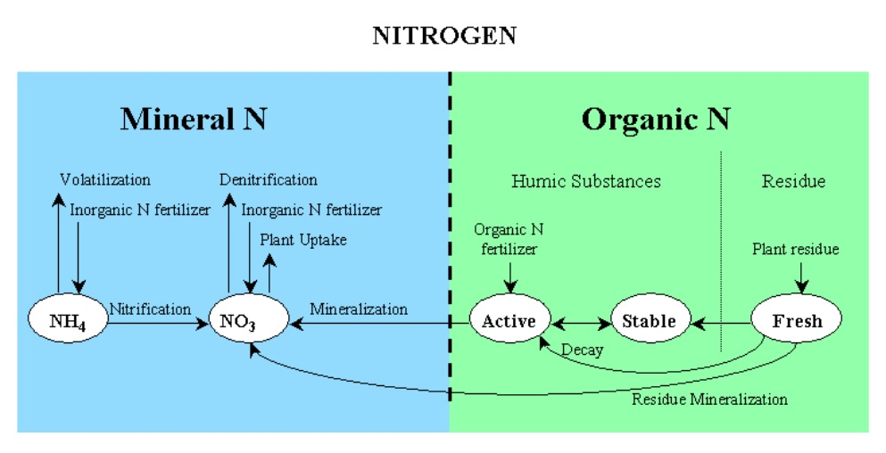

# 3:1.1 Nitrogen Cycle in the Soil

The three major forms of nitrogen in mineral soils are organic nitrogen associated with humus, mineral forms of nitrogen held by soil colloids, and mineral forms of nitrogen in solution. Nitrogen may be added to the soil by fertilizer, manure or residue application, fixation by symbiotic or nonsymbiotic bacteria, and rain. Nitrogen is removed from the soil by plant uptake, leaching, volatilization, denitrification and erosion. Figure 3:1-1 shows the major components of the nitrogen cycle.

Nitrogen is considered to be an extremely reactive element. The highly reactive nature of nitrogen results from its ability to exist in a number of valance states. The valence state or oxidation state describes the number of electrons orbiting the nucleus of the nitrogen atom relative to the number present in an electronically neutral atom. The valence state will be positive as the atom looses electrons and will be negative as the atom gains electrons. Examples of nitrogen in different valence states are:

| most oxidized | +5 | $$NO^-_3$$            | nitrate                        |
| ------------- | -- | --------------------- | ------------------------------ |
|               | +4 | $$NO_2$$              | nitrogen dioxide               |
|               | +3 | $$NO^-_2$$            | nitrite                        |
|               | +2 | $$NO$$                | nitrogen monoxide (gas)        |
|               | +1 | $$N_2O$$              | nitrous oxide (laughing gas)   |
|               | 0  | $$N_2$$               | $$N_2$$ gas or elemental $$N$$ |
|               | -1 | $$NH_4OH$$            | hydroxylamine                  |
|               | -2 | $$N_2H_4$$            | hydrozine                      |
| most reduced  | -3 | $$NH_3 \,or\,NH^+_4$$ | ammonia gas or ammonium        |

The ability of nitrogen to vary its valence state makes it a highly mobile element. Predicting the movement of nitrogen between the different pools in the soil is critical to the successful management of this element in the environment.

SWAT+ monitors five different pools of nitrogen in the soil (Figure 3:1-2). Two pools are inorganic forms of nitrogen, NH4+ and $$NO_3^-$$   , while the other three pools are organic forms of nitrogen. Fresh organic N is associated with crop residue and microbial biomass while the active and stable organic N pools are associated with the soil humus. The organic nitrogen associated with humus is partitioned into two pools to account for the variation in availability of humic substances to mineralization.

