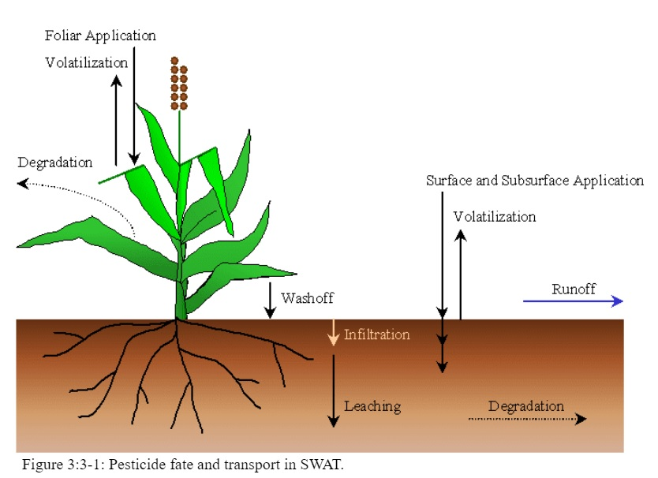

# Pesticides

One of the primary purposes of tillage and harvesting practices in early farming systems was to remove as much plant residue from the field as possible so that pests had no food source to sustain them until the next growing season. As research linked erosion to lack of soil cover, farmers began to perform fewer tillage operations and altered harvesting methods to leave more residue. As mechanical methods of pest control were minimized or eliminated, chemical methods of pest control began to assume a key role in the management of unwanted organisms.

&#x20;        Pesticides are toxic by design, and there is a natural concern about the impact of their presence in the environment on human health and environmental quality. The fate and transport of a pesticide are governed by properties such as solubility in water, volatility and ease of degradation. The algorithms in SWAT+ used to model pesticide movement and fate are adapted from GLEAMS (Leonard et al., 1987).

&#x20;        Pesticide may be aerially applied to an HRU with some fraction intercepted by plant foliage and some fraction reaching the soil. Pesticide may also be incorporated into the soil through tillage. SWAT+ monitors pesticide amounts on foliage and in all soil layers. Figure 3:3-1 shows the potential pathways and processes simulated in SWAT+.

