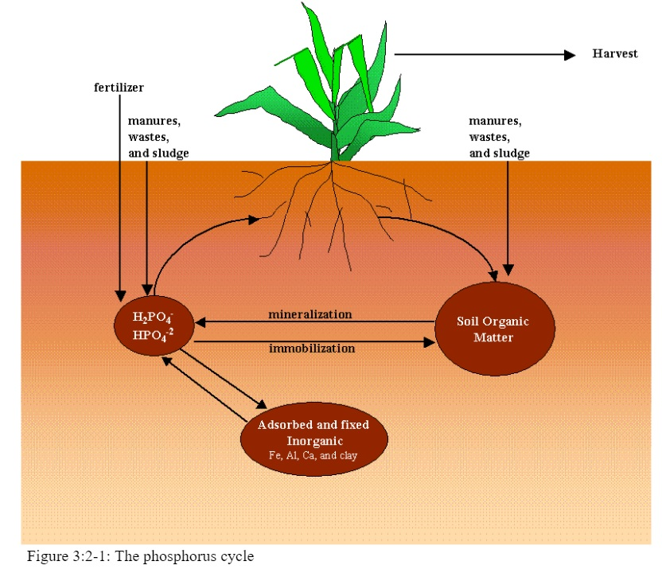
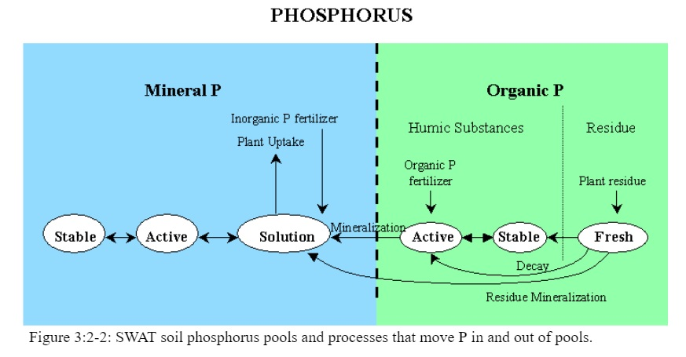

# Phosphorus Cycle

The three major forms of phosphorus in mineral soils are organic phosphorus associated with humus, insoluble forms of mineral phosphorus, and plant-available phosphorus in soil solution. Phosphorus may be added to the soil by fertilizer, manure or residue application. Phosphorus is removed from the soil by plant uptake and erosion. Figure 3:2-1 shows the major components of the phosphorus cycle.

Unlike nitrogen which is highly mobile, phosphorus solubility is limited in most environments. Phosphorus combines with other ions to form a number of insoluble compounds that precipitate out of solution. These characteristics contribute to a build-up of phosphorus near the soil surface that is readily available for transport in surface runoff. Sharpley and Syers (1979) observed that surface runoff is the primary mechanism by which phosphorus is exported from most catchments.

&#x20;           SWAT+ monitors six different pools of phosphorus in the soil (Figure 3:2-2). Three pools are inorganic forms of phosphorus while the other three pools are organic forms of phosphorus. Fresh organic P is associated with crop residue and microbial biomass while the active and stable organic P pools are associated with the soil humus. The organic phosphorus associated with humus is partitioned into two pools to account for the variation in availability of humic substances to mineralization. Soil inorganic P is divided into solution, active, and stable pools. The solution pool is in rapid equilibrium (several days or weeks) with the active pool. The active pool is in slow equilibrium with the stable pool.

