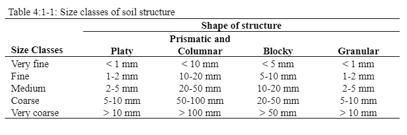

# Soil Erodibility Factor

Some soils erode more easily than others even when all other factors are the same. This difference is termed soil erodibility and is caused by the properties of the soil itself. Wischmeier and Smith (1978) define the soil erodibility factor as the soil loss rate per erosion index unit for a specified soil as measured on a unit plot. A unit plot is 22.1-m (72.6-ft) long, with a uniform length-wise slope of 9-percent, in continuous fallow, tilled up and down the slope. Continuous fallow is defined as land that has been tilled and kept free of vegetation for more than 2 years. The units for the USLE soil erodibility factor in MUSLE are numerically equivalent to the traditional English units of 0.01 (ton acre hr)/(acre ft-ton inch).

&#x20;        Wischmeier and Smith (1978) noted that a soil type usually becomes less erodible with decrease in silt fraction, regardless of whether the corresponding increase is in the sand fraction or clay fraction.

&#x20;      Direct measurement of the erodibility factor is time consuming and costly. Wischmeier et al. (1971) developed a general equation to calculate the soil erodibility factor when the silt and very fine sand content makes up less than 70% of the soil particle size distribution.

$$K_{USLE}=\frac{0.00021*M^{1.14}*(12-OM)+3.25*(c_{soilstr}-2)+2.5*(c_{perm}-3)}{100}$$                                4:1.1.2

where $$K_{USLE}$$ is the soil erodibility factor, $$M$$ is the particle-size parameter, $$OM$$ is the percent organic matter (%), $$c_{soilstr}$$ is the soil structure code used in soil classification, and $$c_{perm}$$ is the profile permeability class.

&#x20;The particle-size parameter, $$M$$, is calculated

$$M=(m_{silt}+m_{vfs})*(100-m_c)$$                                                                    4:1.1.3

where $$m_{silt}$$ is the percent $$silt$$ content (0.002-0.05 mm diameter particles), $$m_{vfs}$$ is the percent very fine sand content (0.05-0.10 mm diameter particles), and $$m_c$$ is the percent clay content (< 0.002 mm diameter particles).

&#x20;        The percent organic matter content, $$OM$$, of a layer can be calculated:

&#x20;                     $$OM=1.72*orgC$$                                                                     4:1.1.4

&#x20;          where $$orgC$$ is the percent organic carbon content of the layer (%).

&#x20;    Soil structure refers to the aggregation of primary soil particles into compound particles which are separated from adjoining aggregates by surfaces of weakness. An individual natural soil aggregate is called a ped. Field description of soil structure notes the shape and arrangement of peds, the size of peds, and the distinctness and durability of visible peds. USDA Soil Survey terminology for structure consists of separate sets of terms defining each of these three qualities. Shape and arrangement of peds are designated as type of soil structure; size of peds as class; and degree of distinctness as grade.

&#x20;      The soil-structure codes for equation 4:1.1.2 are defined by the type and class of soil structure present in the layer. There are four primary types of structure:

-Platy, with particles arranged around a plane, generally horizontal

&#x20;-Prismlike, with particles arranged around a verticle line and bounded by relatively flat vertical surfaces&#x20;

-Blocklike or polyhedral, with particles arranged around a point and bounded by flat or rounded surfaces which are casts of the molds formed by the faces of surrounding peds&#x20;

-Spheroidal or polyhedral, with particles arranged around a point and bounded by curved or very irregular surfaces that are not accomodated to the adjoining aggregates

Each of the last three types has two subtypes:

&#x20;-Prismlike Prismatic: without rounded upper ends Columnar: with rounded caps&#x20;

-Blocklike Angular Blocky: bounded by planes intersecting at relatively sharp angles Subangular Blocky: having mixed rounded and plane faces with vertices mostly rounded&#x20;

-Spheroidal Granular: relatively non-porous Crumb: very porous

The size criteria for the class will vary by type of structure and are summarized in Table 4:1-1. The codes assigned to $$c_{soilstr}$$ are:

&#x20;            1\. very fine granular&#x20;

&#x20;            2.fine granular&#x20;

&#x20;            3.medium or coarse granular&#x20;

&#x20;            4.blocky, platy, prismlike or massive

&#x20;                     Permeability is defined as the capacity of the soil to transmit water and air through the most restricted horizon (layer) when moist. The profile permeability classes are based on the lowest saturated hydraulic conductivity in the profile. The codes assigned to $$c_{perm}$$ are:

&#x20;             1.rapid (> 150 mm/hr)&#x20;

&#x20;             2.moderate to rapid (50-150 mm/hr)&#x20;

&#x20;             3.moderate (15-50 mm/hr)&#x20;

&#x20;             4.slow to moderate (5-15 mm/hr)&#x20;

&#x20;             5.slow (1-5 mm/hr)&#x20;

&#x20;             6.very slow (< 1 mm/hr)

&#x20;     Williams (1995) proposed an alternative equation:

$$K_{USLE}=f_{csand}*f_{cl-si}*f_{orgc}*f_{hisand}$$                                                       4:1.1.5

where $$f_{csand}$$ is a factor that gives low soil erodibility factors for soils with high coarse-sand contents and high values for soils with little sand, $$f_{cl-si}$$ is a factor that gives low soil erodibility factors for soils with high clay to silt ratios, $$f_{orgc}$$ is a factor that reduces soil erodibility for soils with high organic carbon content, and $$f_{hisand}$$ is a factor that reduces soil erodibility for soils with extremely high sand contents. The factors are calculated:

$$f_{csand}=(0.2+0.3*exp[-0.256*m_s*(1-\frac{m_{silt}}{100})])$$                              4:1.1.6

$$f_{cl-si}=(\frac{m_{silt}}{m_c+m_{silt}})^{0.3}$$                                                                                       4:1.1.7

$$f_{orgc}=(1-\frac{0.25*orgC}{orgC+exp[3.72-2.95*orgC]})$$                                                             4:1.1.8

$$f_{hisand}=(1-\frac{0.7*(1-\frac{m_s}{100})}{(1-\frac{m_s}{100})+exp[-5.51+22.9*(1-\frac{m_s}{100})]})$$                                                4:1.1.9

where $$m_s$$ is the percent sand content (0.05-2.00 mm diameter particles), $$m_{silt}$$ is the percent $$silt$$ content (0.002-0.05 mm diameter particles), $$m_c$$ is the percent clay content (< 0.002 mm diameter particles), and $$orgC$$ is the percent organic carbon content of the layer (%).
