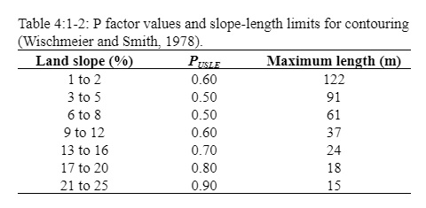
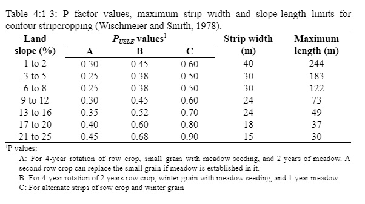
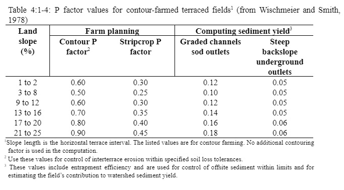

# Support Practice Factor

The support practice factor, $$P_{USLE}$$, is defined as the ratio of soil loss with a specific support practice to the corresponding loss with up-and-down slope culture. Support practices include contour tillage, stripcropping on the contour, and terrace systems. Stabilized waterways for the disposal of excess rainfall are a necessary part of each of these practices.

&#x20;            Contour tillage and planting provides almost complete protection against erosion from storms of low to moderate intensity, but little or no protection against occasional severe storms that cause extensive breakovers of contoured rows. Contouring is most effective on slopes of 3 to 8 percent. Values for $$P_{USLE}$$ and slope-length limits for contour support practices are given in Table 4:1-2.

&#x20;        Stripcropping is a practice in which contoured strips of sod are alternated with equal-width strips of row crop or small grain. Recommended values for contour stripcropping are given in Table 4:1-3.

&#x20;           Terraces are a series of horizontal ridges made in a hillside. There are several types of terraces. Broadbase terraces are constructed on gently sloping land and the channel and ridge are cropped the same as the interterrace area. The steep backslope terrace, where the backslope is in sod, is most common on steeper land. Impoundment terraces are terraces with underground outlets.

&#x20;       Terraces divide the slope of the hill into segments equal to the horizontal terrace interval. With terracing, the slope length is the terrace interval. For broadbase terraces, the horizontal terrace interval is the distance from the center of the ridge to the center of the channel for the terrace below. The horizontal terrace interval for steep backslope terraces is the distance from the point where cultivation begins at the base of the ridge to the base of the frontslope of the terrace below.

&#x20;        Values for $$P_{USLE}$$ for contour farming terraced fields are listed in Table 4:1-4. These values apply to broadbase, steep backslope and level terraces. Keep in mind that the values given in Table 4:1-4 do not account for all erosion control benefits of terraces. The shorter slope-length used in the calculation of the length-slope factor will produce additional reduction.

