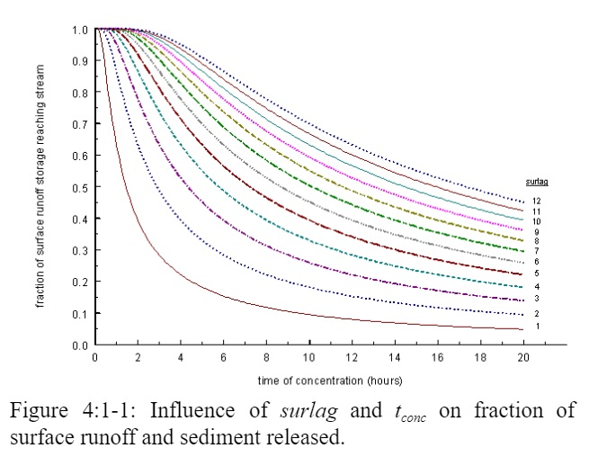

# Sediment Lag in Surface Runoff

&#x20;       In large subbasins with a time of concentration greater than 1 day, only a portion of the surface runoff will reach the main channel on the day it is generated. SWAT+ incorporates a surface runoff storage feature to lag a portion of the surface runoff release to the main channel. Sediment in the surface runoff is lagged as well.

&#x20;                 Once the sediment load in surface runoff is calculated, the amount of sediment released to the main channel is calculated:

&#x20;        $$sed=(sed'+sed_{stor,i-1})*(1-exp[\frac{-surlag}{t_{conc}}])$$                                 4:1.4.1

where $$sed$$ is the amount of sediment discharged to the main channel on a given day (metric tons), $$sed'$$  is the amount of sediment load generated in the HRU on a given day (metric tons), $$sed_{stor,i-1}$$ is the sediment stored or lagged from the previous day (metric tons), $$surlag$$ is the surface runoff lag coefficient, and $$t_{conc}$$ is the time of concentration for the HRU (hrs).

The expression $$(1-exp[\frac{-surlag}{t_{conc}}])$$ in equation 4:1.4.1 represents the fraction of the total available sediment that will be allowed to enter the reach on any one day.&#x20;

Figure 4:1-1 plots values for this expression at different values for $$surlag$$ and $$t_{conc}$$.

Note that for a given time of concentration, as $$surlag$$ decreases in value more sediment is held in storage.

Table 4:1-7: SWAT+ input variables that pertain to sediment lag calculations.

| Variable Name | Definition                                 | Input File |
| ------------- | ------------------------------------------ | ---------- |
| SURLAG        | $$surlag$$: surface runoff lag coefficient | .bsn       |
