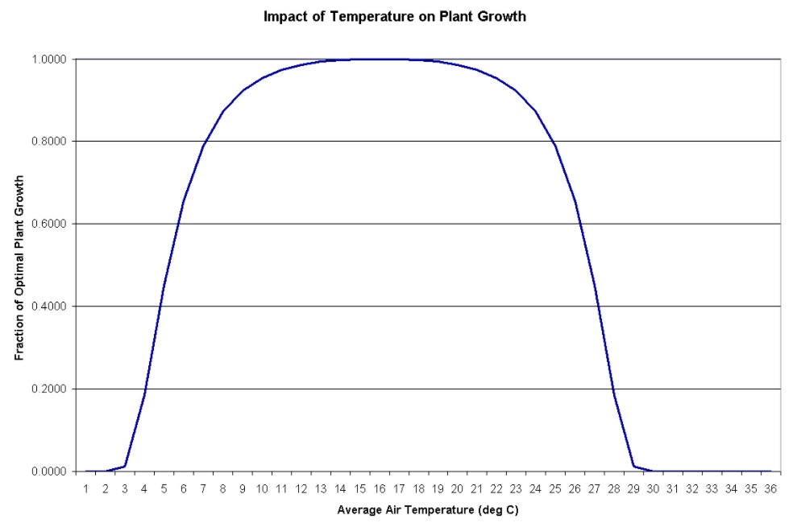

# Temperature Stress

&#x20;                       Temperature stress is a function of the daily average air temperature and the optimal temperature for plant growth. Near the optimal temperature the plant will not experience temperature stress. However as the air temperature diverges from the optimal the plant will begin to experience stress. The equations used to determine temperature stress are:

&#x20; $$tstrs=1$$                                                           when       $$\overline T_{av} \le T_{base}$$                                      5:3.1.2

&#x20;$$tstrs=1-exp[\frac{-0.1054*(T_{opt}-\overline T_{av})^2}{(\overline T_{av}-T_{base})^2}]$$                 when      $$T_{base}<\overline T_{av} \le T_{opt}$$                          5:3.1.3

$$tstrs=1-exp[\frac{-0.1054*(T_{opt}-\overline T_{av})^2}{(2*T_{opt}-\overline T_{av}-T_{base})^2}]$$                   when     $$T_{opt}<\overline T_{av}\le 2*T_{opt}-T_{base}$$        5:3.1.4

$$tstrs=1$$                                                              when      $$\overline T_{av} > 2*T_{opt}-T_{base}$$                    5:3.1.5

where $$tstrs$$ is the temperature stress for a given day expressed as a fraction of optimal plant growth,$$\overline T_{av}$$is the mean air temperature for day (°C), $$T_{base}$$ is the plant’s base or minimum temperature for growth (°C), and $$T_{opt}$$ is the plant’s optimal temperature for growth (°C). Figure 5:3-1 illustrates the impact of mean daily air temperature on plant growth for a plant with a base temperature of 0°C and an optimal temperature of 15°C.

