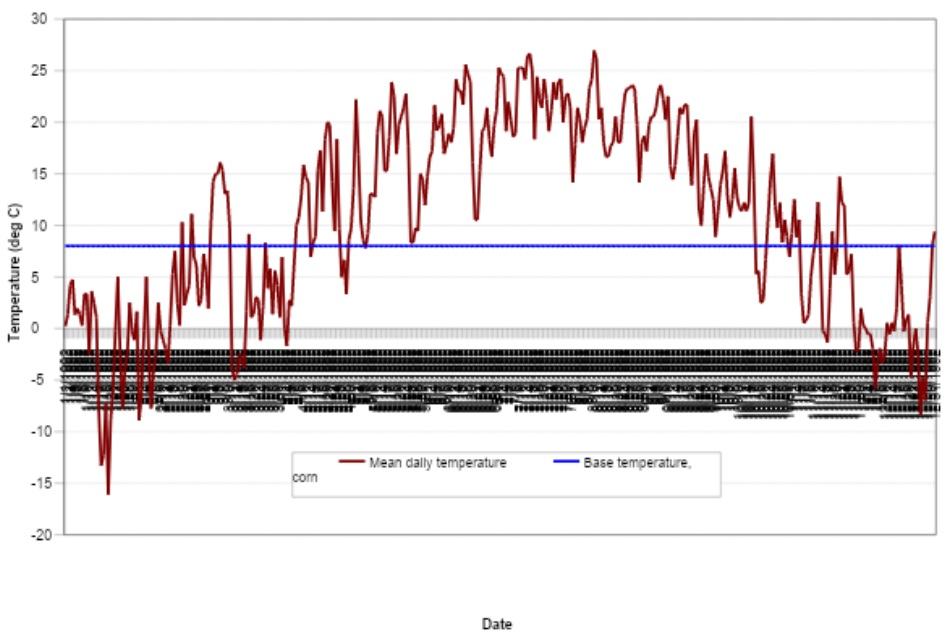

# Heat Units

Temperature is one of the most important factors governing plant growth. Each plant has its own temperature range, i.e. its minimum, optimum, and maximum for growth. For any plant, a minimum or base temperature must be reached before any growth will take place. Above the base temperature, the higher the temperature the more rapid the growth rate of the plant. Once the optimum temperature is exceeded the growth rate will begin to slow until a maximum temperature is reached at which growth ceases.

In the 1920s and 1930s, canning factories were searching for ways to time the planting of sweet peas so that there would be a steady flow of peas at the peak of perfection to the factory. Crops planted at weekly intervals in the early spring would sometimes come to maturity with only a 1- or 2-day differential while at other times there was a 6- to 8-day differential (Boswell, 1926; 1929). A heat unit theory was suggested (Boswell, 1926; Magoon and Culpepper, 1932) that was revised and successfully applied (Barnard, 1948; Phillips, 1950) by canning companies to determine when plantings should be made to ensure a steady harvest of peas with no “bunching” or “breaks”.

The heat unit theory postulates that plants have heat requirements that can be quantified and linked to time to maturity. Because a plant will not grow when the mean temperature falls below its base temperature, the only portion of the mean daily temperature that contributes towards the plant’s development is the amount that exceeds the base temperature. To measure the total heat requirements of a plant, the accumulation of daily mean air temperatures above the plant’s base temperature is recorded over the period of the plant’s growth and expressed in terms of heat units. For example, assume sweet peas are growing with a base temperature of 5°C. If the mean temperature on a given day is 20°C, the heat units accumulated on that day are 20 – 5 = 15 heat units. Knowing the planting date, maturity date, base temperature and mean daily temperatures, the total number of heat units required to bring a crop to maturity can be calculated.

The heat index used by SWAT+ is a direct summation index. Each degree of the daily mean temperature above the base temperature is one heat unit. This method assumes that the rate of growth is directly proportional to the increase in temperature. It is important to keep in mind that the heat unit theory without a high temperature cutoff does not account for the impact of harmful high temperatures. SWAT+ assumes that all heat above the base temperature accelerates crop growth and development.

The mean daily temperature during 1992 for Greenfield, Indiana is plotted in Figure 5:1-1 along with the base temperature for corn (8°C). Crop growth will only occur on those days where the mean daily temperature exceeds the base temperature. The heat unit accumulation for a given day is calculated with the equation:

&#x20;                    $$HU=\overline T_{av}-T_{base}$$ when  $$\overline T_{av}>T_{base}$$                                         5:1.1.1

where $$HU$$ is the number of heat units accumulated on a given day (heat units), is the mean daily temperature (°C), and $$T_{base}$$ is the plant’s base or minimum temperature for growth (°C). The total number of heat units required for a plant to reach maturity is calculated:

&#x20;          $$PHU=\sum_{d=1}^m HU$$                                                                                    5:1.1.2

where $$PHU$$ is the total heat units required for plant maturity (heat units), $$HU$$ is the number of heat units accumulated on day $$d$$ where $$d=1$$ on the day of planting and $$m$$ is the number of days required for a plant to reach maturity. $$PHU$$ is also referred to as potential heat units.

When calculating the potential heat units for a plant, the number of days to reach maturity must be known. For most crops, these numbers have been quantified and are easily accessible. For other plants, such as forest or range, the time that the plants begin to develop buds should be used as the beginning of the growing season and the time that the plant seeds reach maturation is the end of the growing season. For the Greenfield Indiana example, a 120 day corn hybrid was planted on May 15. Summing daily heat unit values, the total heat units required to bring the corn to maturity was 1456.
