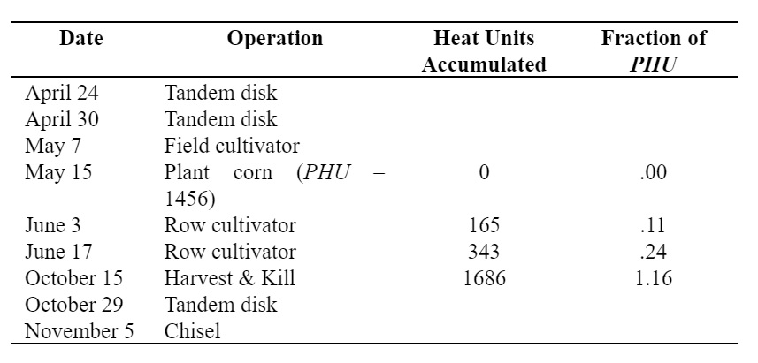
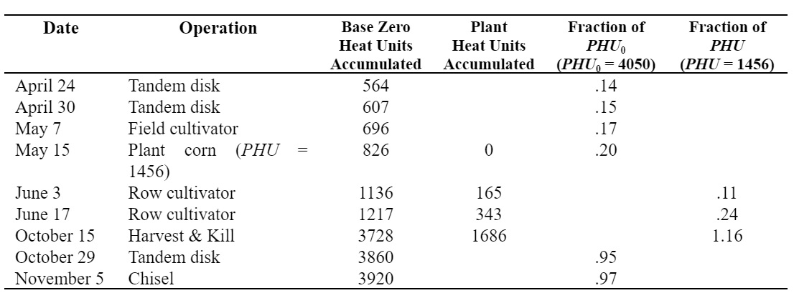
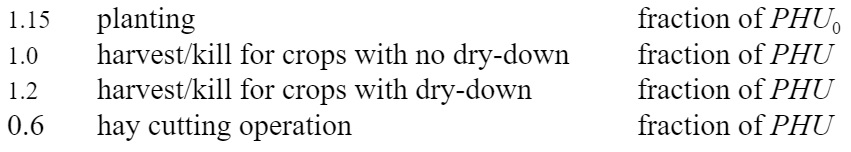

# Heat Unit Scheduling

As the heat unit theory was proven to be a reliable predictor of harvest dates for all types of crops, it was adapted by researchers for prediction of the timing of other plant development stages such as flowering (Cross and Zuber, 1972). The successful adaptation of heat units to predict the timing of plant stages has subsequently led to the use of heat units to schedule management operations.

SWAT+ allows management operations to be scheduled by day or by fraction of potential heat units. For each operation the model checks to see if a month and day has been specified for timing of the operation. If this information is provided, SWAT+ will perform the operation on that month and day. If the month and day are not specified, the model requires a fraction of potential heat units to be specified. As a general rule, if exact dates are available for scheduling operations, these dates should be used.

Scheduling by heat units allows the model to time operations as a function of temperature. This method of timing is useful for several situations. When very large watersheds are being simulated where the climate in one portion of the watershed is different enough from the climate in another section of the watershed to affect timing of operations, heat unit scheduling may be beneficial. By using heat unit scheduling, only one generic management file has to be made for a given land use. This generic set of operations can then be used wherever the land use is found in the watershed. Also, in areas where the climate can vary greatly from year to year, heat unit scheduling will allow the model to adjust the timing of operations to the weather conditions for each year.

While scheduling by heat units is convenient, there are some negatives to using this type of scheduling that users need to take into consideration. In the real world, applications of fertilizer or pesticide are generally not scheduled on a rainy day. However when applications are scheduled by heat units, the user has no knowledge of whether or not the heat unit fraction that triggers the application will occur on a day with rainfall or not. If they do coincide, there will be a significant amount of the applied material transported with surface runoff (assuming runoff is generated on that day), much higher than if the application took place even one day prior to the rainfall event.

To schedule by heat units, the timing of the operations are expressed as fractions of the potential heat units for the plant or fraction of maturity. Let us use the following example for corn in Indiana.

&#x20;    The number of heat units accumulated for the different operation timings is calculated by summing the heat units for every day starting with the planting date (May 15) and ending with the day the operation takes place. To calculate the fraction of $$PHU$$ at which the operation takes place, the heat units accumulated is divided by the $$PHU$$ for the crop (1456).

&#x20;Note that the fraction of $$PHU$$ for the harvest operation is 1.16. The fraction is greater than 1.0 because corn is allowed to dry down prior to harvesting. The model will simulate plant growth until the crop reaches maturity (where maturity is defined as $$PHU$$ = 1456). From that point on, plants will not transpire or take up nutrients and water. They will stand in the HRU until converted to residue or harvested.

While the operations after planting have been scheduled by fraction of $$PHU$$, operations—including planting—which occur during periods when no crop is growing must still be scheduled. To schedule these operations, SWAT+ keeps track of a second heat index where heat units are summed over the entire year using $$T_{base}$$ = 0°C. This heat index is solely a function of the climate and is termed the base zero heat index. For the base zero index, the heat units accumulated on a given day are:

&#x20;   $$HU_0=\overline T_{av}$$  when $$\overline T_{av} >$$0°C                                                                  5:1.1.3

where $$HU_0$$ is the number of base zero heat units accumulated on a given day (heat units), and $$\overline T_{av}$$ is the mean daily temperature (°C). The total number of heat units for the year is calculated:

&#x20;      $$PHU_0=\sum_{d=1}^{365} HU_0$$                                                                            5:1.1.4

where $$PHU_0$$ is the total base zero heat units (heat units), $$HU_0$$ is the number of base zero heat units accumulated on day $$d$$ where $$d=1$$ on January 1 and 365 on December 31. Unlike the plant $$PHU$$ which must be provided by the user, $$PHU_0$$ is the average calculated by SWAT+ using long-term weather data provided in the .wgn file.

For the example watershed in Indiana, $$PHU_0$$= 4050. The heat unit fractions for the remaining operations are calculated using this value for potential heat units.

As stated previously, SWAT+ always keeps track of base zero heat units. The base zero heat unit scheduling is used any time there are no plants growing in the HRU (before and including the plant operation and after the kill operation). Once plant growth is initiated, the model switches to plant heat unit scheduling until the plant is killed.

The following heat unit fractions have been found to provide reasonable timings for the specified operations:

Table 5:1-1: SWAT+ input variables that pertain to heat units.

| Variable Name | Definition                                                                                       | Input File |
| ------------- | ------------------------------------------------------------------------------------------------ | ---------- |
| PHU           | PHU: potential heat units for plant that is growing at the beginning of the simulation in an HRU | .mgt       |
| HEAT UNITS    | $$PHU$$: potential heat units for plant whose growth is initiated with a planting operation.     | .mgt       |
| HUSC          | Fraction of potential heat units at which operation takes place.                                 | .mgt       |
| T\_BASE       | $$T_{base}$$: Minimum temperature for plant growth (°C)                                          | crop.dat   |
