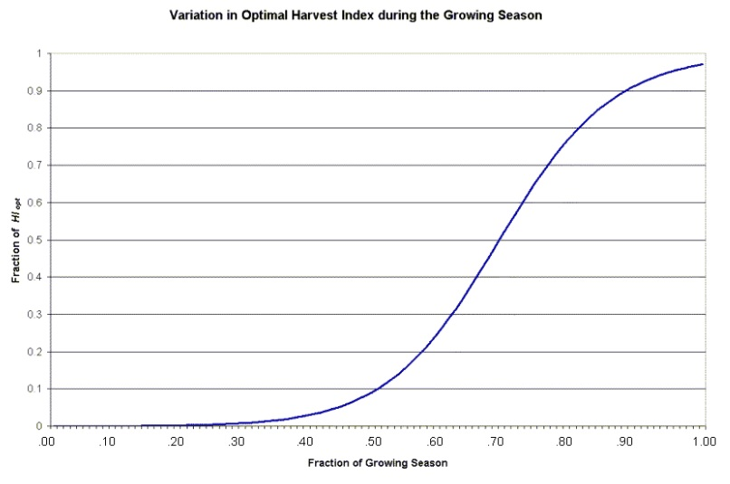

# Crop Yield

&#x20;       When a harvest or harvest/kill operation is performed, a portion of the plant biomass is removed from the HRU as yield. The nutrients and plant material contained in the yield are assumed to be lost from the system (i.e. the watershed) and will not be added to residue and organic nutrient pools in the soil with the remainder of the plant material. In contrast, a kill operation converts all biomass to residue.

&#x20;        The fraction of the above-ground plant dry biomass removed as dry economic yield is called the harvest index. For the majority of crops, the harvest index will be between 0.0 and 1.0. However, plants whose roots are harvested, such as sweet potatoes, may have a harvest index greater than 1.0.

&#x20;         The economic yield of most commercial crops is the reproductive portion of the plant. Decades of crop breeding have lead to cultivars and hybrids having maximized harvest indices. Often, the harvest index is relatively stable across a range of environmental conditions.

&#x20;         SWAT+ calculates harvest index each day of the plant’s growing season using the relationship:

&#x20;          $$HI=HI_{opt}*\frac{100*fr_{PHU}}{(100*fr_{PHU}+exp[11.1-10*fr_{PHU}])}$$                                                       5:2.4.1

where $$HI$$ is the potential harvest index for a given day, $$HI_{opt}$$ is the potential harvest index for the plant at maturity given ideal growing conditions, and $$fr_{PHU}$$ is the fraction of potential heat units accumulated for the plant on a given day in the growing season. The variation of the optimal harvest index during the growing season is illustrated in Figure 5:2-5.&#x20;

&#x20;              The crop yield is calculated as:

&#x20;      $$yld=bio_{ag}*HI$$                          when $$HI \le 1.00$$                                              5:2.4.2

&#x20;      $$yld=bio*(1-\frac{1}{(1+HI)})$$             when  $$HI > 1.00$$                                             5:2.4.3

where $$yld$$ is the crop yield (kg/ha), $$bio_{ag}$$ is the aboveground biomass on the day of harvest (kg ha$$^{-1}$$), $$HI$$ is the harvest index on the day of harvest, and $$bio$$ is the total plant biomass on the day of harvest (kg ha$$^{-1}$$). The aboveground biomass is calculated:

&#x20;            $$bio_{ag}=(1-fr_{root})*bio$$                                                                                 5:2.4.4

where $$fr_{root}$$ is the fraction of total biomass in the roots the day of harvest, and $$bio$$ is the total plant biomass on the day of harvest (kg ha$$^{-1}$$).

&#x20;          The amount of nutrients removed in the yield are calculated:

&#x20;                  $$yld_N=fr_{N,yld}*yld$$                                                                                   5:2.4.5

&#x20;                 $$yld_P=fr_{P,yld}*yld$$                                                                                    5:2.4.6

where $$yld_N$$ is the amount of nitrogen removed in the yield (kg N/ha), $$yld_P$$ is the amount of phosphorus removed in the yield (kg P/ha), $$fr_{N,yld}$$ is the fraction of nitrogen in the yield, $$fr_{P,yld}$$d is the fraction of phosphorus in the yield, and $$yld$$ is the crop yield (kg/ha).

&#x20;               If the harvest index override is used in the harvest only operation, the model assumes that a significant portion of the plant biomass is being removed in addition to the seed. Therefore, instead of using the nitrogen and phosphorus yield fractions from the plant growth database, the model uses the total biomass nitrogen and phosphorus fractions to determine the amount of nitrogen and phosphorus removed:

&#x20;             $$yld_N=fr_N*yld$$                                                                                             5:2.4.7

&#x20;             $$yld_P=fr_P*yld$$                                                                                              5:2.4.8

where $$yld_N$$ is the amount of nitrogen removed in the yield (kg N/ha), $$yld_P$$ is the amount of phosphorus removed in the yield (kg P/ha), $$fr_N$$ is the fraction of nitrogen in the plant biomass calculated with equation 5:2.3.1, $$fr_P$$ is the fraction of phosphorus in the plant biomass calculated with equation 5:2.3.19, and $$yld$$ is the crop yield (kg/ha).

Table 5:2-4: SWAT+ input variables that pertain to crop yield.

| Variable Name | Definition                                                                                     | Input File |
| ------------- | ---------------------------------------------------------------------------------------------- | ---------- |
| HVSTI         | $$HI_{opt}$$: Potential harvest index for the plant at maturity given ideal growing conditions | crop.dat   |
| CNYLD         | $$fr_{N,yld}$$: Fraction of nitrogen in the yield                                              | crop.dat   |
| CPYLD         | $$fr_{P,yld}$$: Fraction of phosphorus in the yield                                            | crop.dat   |
