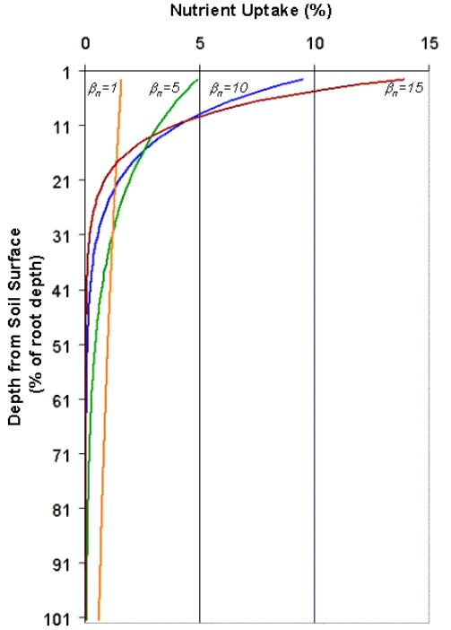

# Nitrogen Uptake

Plant nitrogen uptake is controlled by the plant nitrogen equation. The plant nitrogen equation calculates the fraction of nitrogen in the plant biomass as a function of growth stage given optimal growing conditions.

$$fr_N=(fr_{N,1}-fr_{N,3})*[1-\frac{fr_{PHU}}{fr_{PHU}+exp(n_1-n_2*fr_{PHU})}]+fr_{N,3}$$          5:2.3.1

where $$fr_N$$ is the fraction of nitrogen in the plant biomass on a given day, $$fr_{N,1}$$ is the normal fraction of nitrogen in the plant biomass at emergence, $$fr_{N,3}$$ is the normal fraction of nitrogen in the plant biomass at maturity, $$fr_{PHU}$$ is the fraction of potential heat units accumulated for the plant on a given day in the growing season, and $$n_1$$ and $$n_2$$ are shape coefficients.

&#x20;      The shape coefficients are calculated by solving equation 5:2.3.1 using two known points ($$fr_{N,2}$$, $$fr_{PHU,50\%}$$ ) and ($$fr_{N,3}$$, $$fr_{PHU,100\%}$$):

&#x20;$$n_1=1n[\frac{fr_{PHU,50\%}}{(1-\frac{(fr_{N,2}-fr_{N,3})}{(fr_{N,1}-fr_{N,3})})}-fr_{PHU,50\%}]+n_2*fr_{PHU,50\%}$$                             5:2.3.2

$$n_2=\frac{(1n[\frac{fr_{PHU,50\%}}{(1-\frac{(fr_{N,2}-fr_{N,3})}{(fr_{N,1}-fr_{N,3})})}-fr_{PHU,50\%}]-1n[\frac{fr_{PHU,100\%}}{(1-\frac{(fr_{N,\sim3}-fr_{N,3})}{(fr_{N,1}-fr_{N,3})})}-fr_{PHU,100\%}])}{fr_{PHU,100\%}-fr_{PHU,50\%}}$$                      5:2.3.3

where $$n_1$$ is the first shape coefficient, $$n_2$$ is the second shape coefficient, $$fr_{N,1}$$ is the normal fraction of nitrogen in the plant biomass at emergence, $$fr_{N,2}$$ is the normal fraction of nitrogen in the plant biomass at 50% maturity, $$fr_{N,3}$$ is the normal fraction of nitrogen in the plant biomass at maturity, $$fr_{N,\sim 3}$$ is the normal fraction of nitrogen in the plant biomass near maturity, $$fr_{PHU,50\%}$$ is the fraction of potential heat units accumulated for the plant at 50% maturity ($$fr_{PHU,50\%}$$=0.5), and $$fr_{PHU,100\%}$$ is the fraction of potential heat units accumulated for the plant at maturity                       ($$fr_{PHU,100\%}$$=1.0). The normal fraction of nitrogen in the plant biomass near maturity ($$fr_{N,\sim 3}$$) is used in equation 5:2.3.3 to ensure that the denominator term $$(1-\frac{(fr_{N,\sim3}-fr_{N,3})}{(fr_{N,1}-fr_{N,3})})$$ does not equal 1. The model assumes $$(fr_{N,\sim 3}-fr_{N,3})=0.00001$$

&#x20;            To determine the mass of nitrogen that should be stored in the plant biomass on a given day, the nitrogen fraction is multiplied by the total plant biomass:

&#x20;                   $$bio_{N,opt}=fr_N*bio$$                                                                                               5:2.3.4

where $$bio_{N,opt}$$ is the optimal mass of nitrogen stored in plant material for the current growth stage (kg N/ha), $$fr_N$$ is the optimal fraction of nitrogen in the plant biomass for the current growth stage, and $$bio$$ is the total plant biomass on a given day (kg ha$$^{-1}$$).

&#x20;   Originally, SWAT+ calculated the plant nitrogen demand for a given day by taking the difference between the nitrogen content of the plant biomass expected for the plant’s growth stage and the actual nitrogen content $$N_{up}=bio_{N,opt}-bio_N$$. This method was found to calculate an excessive nitrogen demand immediately after a cutting (i.e. harvest operation). The equation used to calculate plant nitrogen demand is now

&#x20;              $$N_{up}=Min \begin{cases} bio_{N,opt}-bio_N \\ 4*fr_{N,3}* \Delta bio  \end {cases}$$                                                                          5:2.3.5

where $$N_{up}$$ is the potential nitrogen uptake (kg N/ha), $$bio_{N,opt}$$ is the optimal mass of nitrogen stored in plant material for the current growth stage (kg N/ha), $$bio_N$$ is the actual mass of nitrogen stored in plant material (kg N/ha), $$fr_{N,3}$$ is the normal fraction of nitrogen in the plant biomass at maturity, and $$\Delta bio$$ is the potential increase in total plant biomass on a given day (kg/ha).

&#x20;          The depth distribution of nitrogen uptake is calculated with the function:

&#x20;                              $$N_{up,z}=\frac{N_{up}}{[1-exp(-\beta_n)]}*[1-exp(-\beta_n*\frac{z}{z_{root}})]$$                                   5:2.3.6

where $$N_{up,z}$$ is the potential nitrogen uptake from the soil surface to depth $$z$$ (kg N/ha), $$N_{up}$$ is the potential nitrogen uptake (kg N/ha), $$\beta_n$$ is the nitrogen uptake distribution parameter, $$z$$ is the depth from the soil surface (mm), and $$z_{root}$$ is the depth of root development in the soil (mm). Note that equation 5:2.3.6 is similar in form to the depth distribution for water uptake described by equation 5:2.2.1. The potential nitrogen uptake for a soil layer is calculated by solving equation 5:2.3.6 for the depth at the upper and lower boundaries of the soil layer and taking the difference.

&#x20;         $$N_{up,ly}=N_{up,zl}-N_{up,zu}$$                                                                                        5:2.3.7

where $$N_{up,ly}$$ is the potential nitrogen uptake for layer $$ly$$ (kg N/ha), $$N_{up,zl}$$ is the potential nitrogen uptake from the soil surface to the lower boundary of the soil layer (kg N/ha), and $$N_{up,zu}$$ is the potential nitrogen uptake from the soil surface to the upper boundary of the soil layer (kg N/ha).

&#x20;            Root density is greatest near the surface, and nitrogen uptake in the upper portion of the soil will be greater than in the lower portion. The depth distribution of nitrogen uptake is controlled by $$\beta_n$$, the nitrogen uptake distribution parameter, a variable users are allowed to adjust. Figure 5:2-4 illustrates nitrogen uptake as a function of depth for four different uptake distribution parameter values.

&#x20;          Nitrogen removed from the soil by plants is taken from the nitrate pool. The importance of the nitrogen uptake distribution parameter lies in its control over the maximum amount of nitrate removed from the upper layers. Because the top 10 mm of the soil profile interacts with surface runoff, the nitrogen uptake distribution parameter will influence the amount of nitrate available for transport in surface runoff. The model allows lower layers in the root zone to fully compensate for lack of nitrate in the upper layers, so there should not be significant changes in nitrogen stress with variation in the value used for $$\beta_n$$.&#x20;

&#x20;            The actual amount if nitrogen removed from a soil layer is calculated:

&#x20;                       $$N_{actualup,ly}=min\lfloor N_{up,ly} +N_{demand},NO3_{ly}\rfloor$$                                             5:2.3.8

where $$N_{actualup,ly}$$ is the actual nitrogen uptake for layer $$ly$$ (kg N/ha), $$N_{up,ly}$$ is the potential nitrogen uptake for layer $$ly$$ (kg N/ha), $$N_{demand}$$ is the nitrogen uptake demand not met by overlying soil layers (kg N/ha), and $$NO3_{ly}$$ is the nitrate content of soil layer $$ly$$ (kg NO$$_3$$-N/ha).

