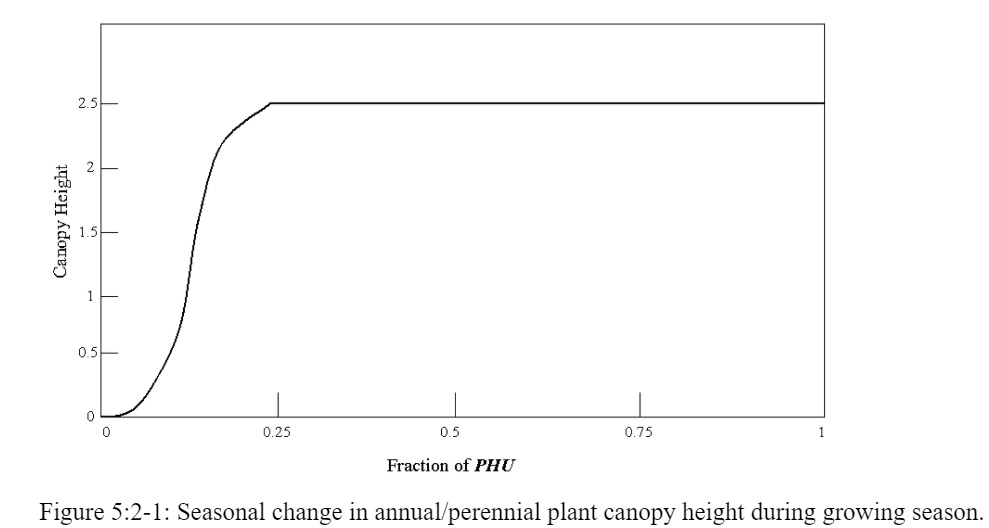
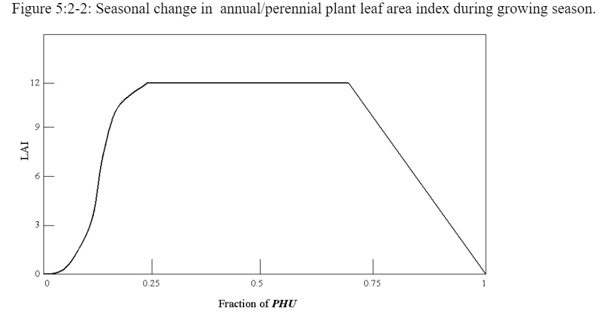

# Canopy Cover and Height

The change in canopy height and leaf area for annuals and perennials through the growing season as modeled by SWAT+ is illustrated using parameters for Alamo Switchgrass in Figures 5:2-1 and 5:2-2.

In the initial period of plant growth, canopy height and leaf area development are controlled by the optimal leaf area development curve:

&#x20;      $$fr_{LAImx}=\frac{fr_{PHU}}{fr_{PHU}+exp(\Box_1 - \Box_2 * fr_{PHU})}$$                                                          5:2.1.10

where $$fr_{LAImx}$$ is the fraction of the plant’s maximum leaf area index corresponding to a given fraction of potential heat units for the plant, $$fr_{PHU}$$ is the fraction of potential heat units accumulated for the plant on a given day in the growing season, and $$\Box_1$$and $$\Box_2$$  are shape coefficients. The fraction of potential heat units accumulated by a given date is calculated:

&#x20;        $$fr_{PHU}=\frac{\sum_{i=1}^d HU_i}{PHU}$$                                                                                  5:2.1.11

&#x20;where $$fr_{PHU}$$ is the fraction of potential heat units accumulated for the plant on  day d in the growing season, $$HU$$ is the heat units accumulated on day $$i$$ (heat units), and $$PHU$$ is the total potential heat units for the plant (heat units).

&#x20;      The shape coefficients are calculated by solving equation 5:2.1.10 using two known points ($$fr_{LAI,1}$$,$$fr_{PHU,1}$$) and ($$fr_{LAI,2}$$,$$fr_{PHU,2}$$):

&#x20;             $$\Box_1=1n[\frac{fr_{PHU,1}}{fr_{LAI,1}}-fr_{PHU,1}]+\Box_2*fr_{PHU,1}$$                                    5:2.1.12

&#x20;             $$\Box_2=\frac{(1n[\frac{fr_{PHU,1}}{fr_{LAI,1}}-fr_{PHU,1}]-1n[\frac{fr_{PHU,2}}{fr_{LAI,2}}-fr_{PHU,2}])}{fr_{PHU,2}-fr_{PHU,1}}$$                                         5:2.1.13

where $$\Box_1$$ is the first shape coefficient, $$\Box_2$$ is the second shape coefficient, $$fr_{PHU,1}$$ is the fraction of the growing season (i.e. fraction of total potential heat units) corresponding to the 1st point on the optimal leaf area development curve, $$fr_{LAI,1}$$ is the fraction of the maximum plant leaf area index (i.e. fraction of $$LAI_{mx}$$) corresponding to the 1st point on the optimal leaf area development curve, $$fr_{PHU,2}$$ is the fraction of the growing season corresponding to the 2nd point on the optimal leaf area development curve, and $$fr_{LAI,2}$$ is the fraction of the maximum plant leaf area index corresponding to the 2nd point on the optimal leaf area development curve.

&#x20;         The canopy height on a given day is calculated:

&#x20;                            $$h_c=h_{c,mx}*\sqrt{fr_{LAImx}}$$                                                           5:2.1.14

where $$h_c$$ is the canopy height for a given day (m), $$h_{c,mx}$$ is the plant’s maximum canopy height (m), and $$fr_{LAI,mx}$$ is the fraction of the plant’s maximum leaf area index corresponding to a given fraction of potential heat units for the plant. As can be seen from Figure 5:2-1, once the maximum canopy height is reached, $$h_c$$ will remain constant until the plant is killed.

&#x20;         For tree stands, the canopy height varies from year to year rather than day to day:

&#x20;                              $$h_c=h_{c,mx}*(\frac{yr_{cur}}{yr_{fulldev}})$$                                                             5:2.1.15

where $$h_c$$ is the canopy height for a given day (m), $$h_{c,mx}$$ is the plant’s maximum canopy height (m), $$yr_{cur}$$ is the age of the tree (years), and $$yr_{fulldev}$$ is the number of years for the tree species to reach full development (years).

&#x20;          The amount of canopy cover is expressed as the leaf area index. For annuals and perennials, the leaf area added on day $$i$$ is calculated:

&#x20;                $$\Delta LAI_i=(fr_{LAImx,i}-fr_{LAImx,i-1})*LAI_{mx}*(1-exp(5*(LAI_{i-1}-LAI_{mx})))$$

&#x20;                                                                                                                                          5:2.1.16

while for trees, the leaf area added on day $$i$$ is calculated:

&#x20;        $$\Delta LAI_i=(fr_{LAImx,i}-fr_{LAImx,i-1})*(\frac{yr_{cur}}{yr_{fulldev}})*LAI_{mx}*(1-exp(5*(LAI_{i-1}-(\frac{yr_{cur}}{yr_{fulldev}})*LAI_{mx})))$$

&#x20;                                                                                                                                        5:2.1.17

The total leaf area index is calculated:

&#x20;      $$LAI_i=LAI_{i-1}+\Delta LAI_{i}$$                                                                                   5:2.1.18

where $$\Delta LAI_i$$ is the leaf area added on day $$i$$, $$LAI_i$$ and $$LAI_{i-1}$$ are the leaf area indices for day $$i$$ and $$i-1$$ respectively, $$fr_{LAImx,i}$$ and $$fr_{LAImx,i-1}$$ are the fraction of the plant’s maximum leaf area index calculated with equation 5:2.1.10 for day $$i$$ and $$i-1$$,$$LAI_{mx}$$ is the maximum leaf area index for the plant, $$yr_{cur}$$ is the age of the tree (years), and $$yr_{fulldev}$$ is the number of years for the tree species to reach full development (years).

&#x20;           Leaf area index is defined as the area of green leaf per unit area of land (Watson, 1947). As shown in Figure 5:2-2, once the maximum leaf area index is reached, $$LAI$$ will remain constant until leaf senescence begins to exceed leaf growth. Once leaf senescence becomes the dominant growth process, the leaf area index for annuals and perrenials is calculated:

&#x20;         $$LAI=LAI_{mx}*\frac{(1-fr_{PHU})}{(1-fr_{PHU,sen})}$$               $$fr_{PHU}>fr_{PHU,sen}$$       5:2.1.19

while for trees, the calculation is

&#x20;    $$LAI=(\frac{yr_{cur}}{yr_{fulldev}})*LAI_{mx}*\frac{(1-fr_{PHU})}{(1-fr_{PHU,sen})}$$     $$fr_{PHU}>fr_{PHU,sen}$$     5:2.1.20

where $$LAI$$ is the leaf area index for a given day, $$LAI_{mx}$$ is the maximum leaf area index, $$fr_{PHU}$$ is the fraction of potential heat units accumulated for the plant on a given day in the growing season, $$fr_{PHU,sen}$$ is the fraction of growing season ($$PHU$$) at which senescence becomes the dominant growth process, $$yr_{cur}$$ is the number of years of development the tree has accrued (years), and $$yr_{fulldev}$$ is the number of years for the tree species to reach full development (years).
