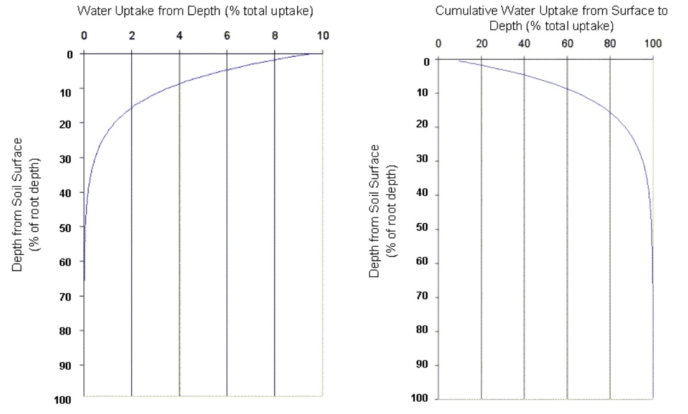

# Water Uptake by Plants

The potential water uptake from the soil surface to any depth in the root zone is estimated with the function:

&#x20;           $$w_{up,z}=\frac{E_t}{[1-exp(-\beta_w)]}*[1-exp(-\beta_w*\frac{z}{z_{root}})]$$                                5:2.2.1

where $$w_{up,z}$$ is the potential water uptake from the soil surface to a specified depth, $$z$$, on a given day (mm H$$_2$$O), $$E_t$$ is the maximum plant transpiration on a given day          (mm H$$_2$$O), $$\beta_w$$ is the water-use distribution parameter, $$z$$ is the depth from the soil surface (mm), and $$z_{root}$$ is the depth of root development in the soil (mm). The potential water uptake from any soil layer can be calculated by solving equation 5:2.2.1 for the depth at the top and bottom of the soil layer and taking the difference.

&#x20;              $$w_{up,ly}=w_{up,zl}-w_{up,zu}$$                                                               5:2.2.2

where $$w_{up,ly}$$ is the potential water uptake for layer $$ly$$ (mm H$$_2$$O), $$w_{up,zl}$$ is the potential water uptake for the profile to the lower boundary of the soil layer (mm H$$_2$$O), and $$w_{up,zu}$$ is the potential water uptake for the profile to the upper boundary of the soil layer        (mm H$$_2$$O).

&#x20;                Since root density is greatest near the soil surface and decreases with depth, the water uptake from the upper layers is assumed to be much greater than that in the lower layers. The water-use distribution parameter, $$\beta_w$$, is set to 10 in SWAT+. With this value, 50% of the water uptake will occur in the upper 6% of the root zone. Figure 5:2-3 graphically displays the uptake of water at different depths in the root zone.

The amount of water uptake that occurs on a given day is a function of the amount of water required by the plant for transpiration, $$E_t$$, and the amount of water available in the soil, $$SW$$. Equations 5:2.2.1 and 5:2.2.2 calculate potential water uptake solely as a function of water demand for transpiration and the depth distribution defined in equation 5:2.2.1. SWAT+ modifies the initial potential water uptake from a given soil layer to reflect soil water availability in the following ways.
