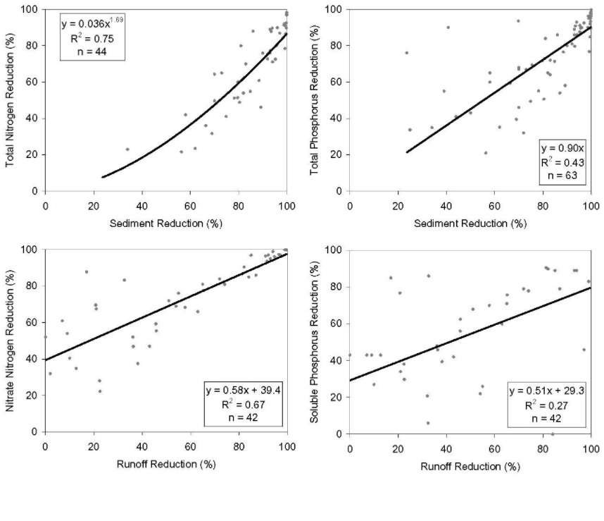

# Total Nitrogen

&#x20;      The total nitrogen model was based on sediment reduction only. Much of the nitrogen lost in runoff from agricultural fields travels with sediments. Harmel et al. (2006) found that approximately 75% of the nitrogen lost from conventional tilled fields was in particulate forms. They also found that dissolved nitrogen forms, such as nitrate, were more dominant in no-till treatments. The vast majority of VFS data derived from literature were designed to simulate higher erosion conditions where particulate forms would represent the majority of nitrogen losses.&#x20;

&#x20;              The total nitrogen model was based on sediment reduction from 44 observations reported in the literature. Two trials were censored during the development of the model. These experiments from Magette et al. (1989) yielded significant increases in total nitrogen exiting the VFS. The authors attributed this phenomenon to flushing of fine particulates captured in the VFS from prior experimental trials. Both the slope and the intercept were significant (P < 0.01). The model is given below and shown in Figure 6:5-3.

&#x20;                                                        $$TN_R=0.036 S_R^{1.69}$$                                                          6:5.1.3

where $$TN_R$$ is the total nitrogen reduction (%); and $$S_R$$ is the sediment reduction (%). Although this model was developed from total nitrogen, which includes both soluble and particulate forms, it was applied only to particulate forms in the SWAT+ model.

