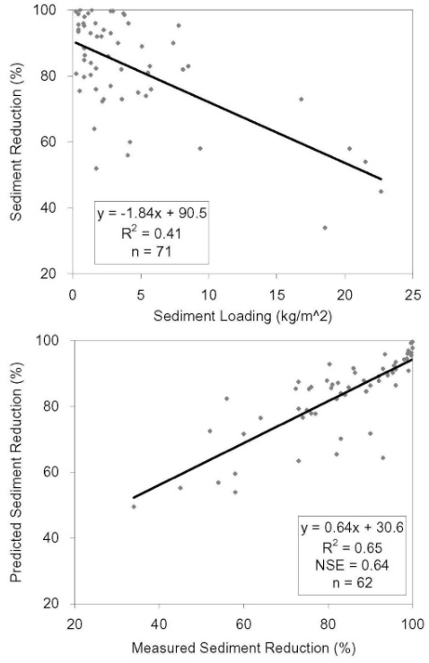

# Sediment Reduction Model

The sediment reduction model developed for SWAT+ was based on measured VFS data. A VFS removes sediment by reducing runoff velocity due to increased resistance of the vegetative media and enhanced infiltration in the VFS area (Barfield et al., 1998). Both result in a reduction in transport capacity and the deposition of sediment. Both the filtering and infiltration aspects are represented in the model. Similar to the runoff loading approach used earlier, sediment loading per unit VFS area was found to correlate with measured sediment reduction. Dosskey et al. (2002) hypothesized that sediment trapping efficiency decreases as the load per unit of buffer area increases. Sediment loading was calculated as the mass of sediment originating from the upslope area per unit of VFS area express as kg m$$^{-2}$$. The infiltration aspect was represented in the model by incorporating the runoff reduction as a percentage. Sixty-two experiments reported in the literature were used to develop this model.

&#x20;                           $$S_R(\%)=79.0-1.04   S_L+0.213R_R$$                                                      6:5.1.2

where $$S_R$$ is the predicted sediment reduction (%); $$S_L$$ is sediment loading (kg/m$$^2$$); and $$R_R$$ is the runoff reduction (%). Sediment loading alone was correlated with sediment reduction ($$R^2$$ = 0.41) (Figure 6:5-2). The addition of runoff reduction allowed the regression model to explain most of the variability ($$R^2$$ = 0.64) in the measured data.

