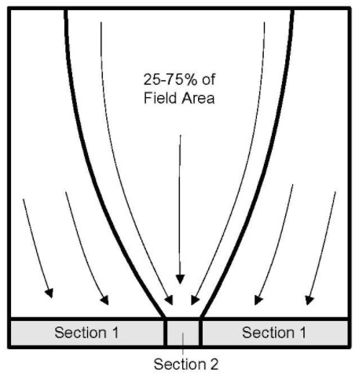

# VFS SWAT+ Model Structure

VFSs were implemented at the HRU level in SWAT+.  Three additional model parameters were added as SWAT+ inputs: the drainage area to VFS area ratio ($$DAFS_{ratio}$$), the fraction of the field drained by the most heavily loaded 10% of the VFS ($$DF_{con}$$), and the fraction of the flow through the most heavily loaded 10% of the VFS which is fully channelized ($$CF_{frac}$$), all are specified in the HRU (.hru) file.  A two-segment VFS was used.  Section one represents the bulk of the VFS area (90%) which receives the least flow.  Section two is the remaining 10% of the buffer which receives between 25% and 75% of the field runoff (Figure 6:5-4).

The fraction of flow through section two which is channelized is not subject to the VFS model; all sediment and nutrient are conservatively delivered to the tributary channel. $$DAFS_{ratio}$$ for sections one and two are calculated from $$DF_{con}$$ using the following equations:&#x20;

&#x20;                        $$DAFS_{ratio1}=DAFS_{ratio}(1-DF_{con})/0.9$$                             6:5.1.7&#x20;

&#x20;                        $$DAFS_{ratio2}=DAFS_{ratio}(1-CF_{frac})DF_{con}/0.1$$                 6:5.1.8&#x20;

where $$DAFS_{ratio1}$$ is the drainage area to VFS area ratio for section 1; $$DAFS_{ratio2}$$ is the drainage area to the VFS area ratio for section 2; $$DAFS_{ratio}$$ is the average drainage area to the VFS area ratio for the entire HRU (user input).; $$CF_{frac}$$ is fraction of the flow through the most heavily loaded 10% of the VFS which is fully channelized (user input); and $$DF_{con}$$ is the fraction of the field drained by the most heavily loaded 10% of the VFS (user input). Sediment, runoff, and nutrient loadings are calculated assuming all are generated uniformly across the HRU. The $$DAFS_{ratio}$$ for each VFS section is combined with SWAT+ HRU level runoff and sediment yield predictions to calculate the runoff and sediment loadings. Equations 6:5.1-6 are applied to predict sediment and nutrient transport through the VFS. The fraction of runoff retained in VFS is calculated for the purposes of estimating the retention of other constituents only. It is beyond the scope of this research to predict the aspects of a VFS’s hydrologic budget needed to represent that component in the SWAT+ model. In addition, the area occupied by VFSs within a SWAT+ HRU is not removed from that HRU for simplicity. For these reasons, the VFS routine in SWAT+ is not used to predict changes in runoff delivered to streams.\
&#x20;             The VFS SWAT+ sub model also includes pesticides and bacteria. Due to a lack of measured data, these models are based on assumptions. The pesticide model assumes that pesticides sorbed to sediments are captured with the sediment, and soluble pesticides are captured with runoff. Similarly, bacteria, which are attached to sediment, are captured with sediment and unattached bacteria are captured with runoff. These assumptions are common in the structure of other SWAT+ model components.
