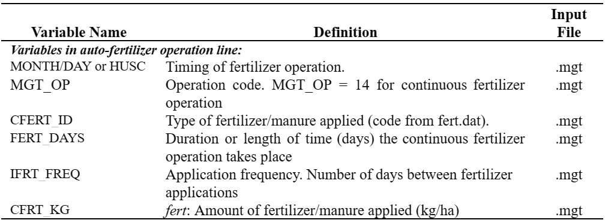

# Continuous Application of Fertilizer

&#x20;        A primary mechanism of disposal for manure generated by intensive animal operations such as confined animal feedlots is the land application of waste. In this type of a land management system, waste is applied every few days to the fields. Using the continuous fertilization operation allows a user to specify the frequency and quantity of manure applied to an HRU without the need to insert a fertilizer operation in the management file for every single application.&#x20;

&#x20;             The continuous fertilizer operation requires the user to specify the beginning date of the continuous fertilization period, the total length of the fertilization period, and the number of days between individual fertilizer/manure applications. The amount of fertilizer/manure applied in each application is specified as well as the type of fertilizer/manure.&#x20;

&#x20;                 Nutrients and bacteria in the fertilizer/manure are applied to the soil surface. Unlike the fertilization operation or auto-fertilization operation, the continuous fertilization operation does not allow the nutrient and bacteria loadings to be partitioned between the surface 10 mm and the part of the 1st soil layer underlying the top 10 mm. Everything is added to the top 10 mm, making it available for transport by surface runoff.&#x20;

&#x20;                     Nutrient and bacteria loadings to the HRU are calculated using the equations reviewed in Section 6:1.7.

Table 6:1-9: SWAT+ input variables that pertain to continuous fertilization.

