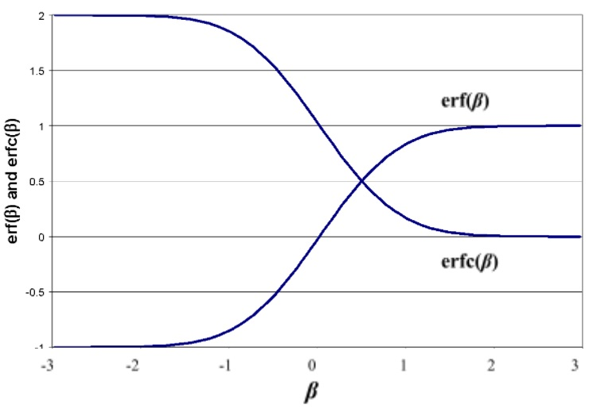
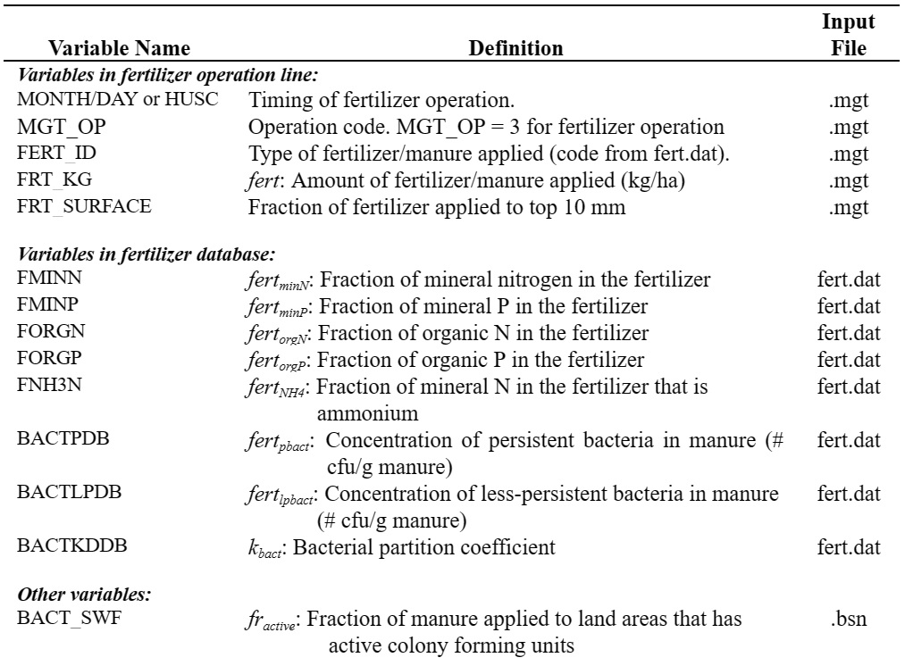

# Fertilizer Application

&#x20;                The fertilizer operation applies fertilizer or manure to the soil.&#x20;

&#x20;                Information required in the fertilizer operation includes the timing of the operation (month and day or fraction of plant potential heat units), the type of fertilizer/manure applied, the amount of fertilizer/manure applied, and the depth distribution of fertilizer application.&#x20;

&#x20;                SWAT+ assumes surface runoff interacts with the top 10 mm of soil. Nutrients contained in this surface layer are available for transport to the main channel in surface runoff. The fertilizer operation allows the user to specify the fraction of fertilizer that is applied to the top 10 mm. The remainder of the fertilizer is added to the first soil layer defined in the HRU .sol file.

&#x20;                In the fertilizer database, the weight fraction of different types of nutrients and bacteria are defined for the fertilizer. The amounts of nutrient added to the different pools in the soil are calculated:

&#x20;             $$NO3_{fert}=fert_{minN}*(1-fert_{NH4})*fert$$                                              6:1.7.1

&#x20;             $$NH4_{fert}=fert_{minN}*fert_{NH4}*fert$$                                                        6:1.7.2

&#x20;             $$orgN_{frsh,fert}=0.5*fert_{orgN}*fert$$                                                           6:1.7.3

&#x20;             $$orgN_{act,fert}=0.5*fert_{orgN}*fert$$                                                              6:1.7.4

&#x20;             $$P_{solution,fert}=fert_{minP}*fert$$                                                                        6:1.7.5

&#x20;             $$orgP_{frsh,fert}=0.5*fert_{orgP}*fert$$                                                             6:1.7.6

&#x20;             $$orgP_{hum,fert}=0.5*fert_{orgP}*fert$$                                                              6:1.7.7

&#x20;where $$NO3_{fert}$$ is the amount of nitrate added to the soil in the fertilizer (kg N/ha), $$NH4_{fert}$$ is the amount of ammonium added to the soil in the fertilizer (kg N/ha), $$orgN_{frsh,fert}$$   is the amount of nitrogen in the fresh organic pool added to the soil in the fertilizer (kg N/ha), $$orgN_{act,fert}$$ is the amount of nitrogen in the active organic pool added to the soil in the fertilizer (kg N/ha), $$P_{solution,fert}$$ is the amount of phosphorus in the solution pool added to the soil in the fertilizer (kg P/ha), $$orgP_{frsh,fert}$$ is the amount of phosphorus in the fresh organic pool added to the soil in the fertilizer (kg P/ha), $$orgP_{hum,fert}$$ is the amount of phosphorus in the humus organic pool added to the soil in the fertilizer (kg P/ha), $$fert_{minN}$$ is the fraction of mineral N in the fertilizer, $$fert_{NH4}$$ is the fraction of mineral $$N$$ in the fertilizer that is ammonium, $$fert_{orgN}$$ is the fraction of organic $$N$$ in the fertilizer, $$fert_{minP}$$ is the fraction of mineral $$P$$ in the fertilizer, $$fert_{orgP}$$ is the fraction of organic $$P$$ in the fertilizer, and $$fert$$ is the amount of fertilizer applied to the soil (kg/ha).

&#x20;        If manure is applied, the bacteria in the manure may become attached to plant foliage or be incorporated into the soil surface layer during application. The amount of bacteria reaching the ground surface and the amount of bacteria adhering to the plant foliage is calculated as a function of ground cover. The ground cover provided by plants is:

&#x20;             $$gc=\frac{1.99532-erfc[1.333*LAI-2]}{2.1}$$                                                                                 6:1.7.8

where $$gc$$ is the fraction of the ground surface covered by plants, $$erfc$$ is the complementary error function, and $$LAI$$ is the leaf area index.

&#x20;       The complementary error function frequently occurs in solutions to advective-dispersive equations. Values for $$erfc(\beta)$$ and $$erf(\beta)$$ ($$erf$$ is the error function for $$\beta$$), where $$\beta$$ is the argument of the function, are graphed in Figure 6:1-1. The figure shows that $$erf(\beta)$$ ranges from –1 to +1 while $$erfc(\beta)$$ ranges from 0 to +2. The complementary error function takes on a value greater than 1 only for negative values of the argument.

&#x20;  Once the fraction of ground covered by plants is known, the amount of bacteria applied to the foliage is calculated:

&#x20;              $$bact_{lp,fol}=\frac{gc*fr_{active}*fert_{lpbact}*fert}{10}$$                                                                        6:1.7.9

&#x20;              $$bact_{p,fol}=\frac{gc*fr_{active}*fert_{pbact}*fert}{10}$$                                                                          6:1.7.10

and the amount of bacteria applied to the soil surface is

&#x20;              $$bact_{lpsol,fert}=\frac{(1-gc)*fr_{active}*fert_{lpbact}*k_{bact}*fert}{10}$$                                                      6:1.7.11

&#x20;              $$bact_{lpsorb,fert}=\frac{(1-gc)*fr_{active}*fert_{lpbact}*(1-k_{bact})*fert}{10}$$                                              6:1.7.12

&#x20;              $$bact_{psol,fert}=\frac{(1-gc)*fr_{active}*fert_{pbact}*k_{bact}*fert}{10}$$                                                       6:1.7.13

&#x20;              $$bact_{psorb,fert}=\frac{(1-gc)*fr_{active}*fert_{pbact}*(1-k_{bact})*fert}{10}$$                                               6:1.7.14

where $$bact_{lp,fol}$$ is the amount of less persistent bacteria attached to the foliage (# cfu/m$$^2$$), $$bact_{p,fol}$$ is the amount of persistent bacteria attached to the foliage (# cfu/m$$^2$$), $$bact_{lpsol,fert}$$ is the amount of less persistent bacteria in the solution pool added to the soil (# cfu/m$$^2$$), $$bact_{lpsorb,fert}$$ is the amount of less persistent bacteria in the sorbed pool added to the soil (# cfu/m$$^2$$), $$bact_{psol,fert}$$ is the amount of persistent bacteria in the solution pool added to the soil (# cfu/m$$^2$$), $$bact_{psorb,fert}$$ is the amount of persistent bacteria in the sorbed pool added to the soil (# cfu/m$$^2$$), $$gc$$ is the fraction of the ground surface covered by plants, $$fr_{active}$$ is the fraction of the manure containing active colony forming units, $$fert_{lpbact}$$ is the concentration of less persistent bacteria in the fertilizer (# cfu/g manure), $$fert_{pbact}$$ is the concentration of persistent bacteria in the fertilizer (# cfu/g manure), $$k_{bact}$$ is the bacterial partition coefficient, and $$fert$$ is the amount of fertilizer/manure applied to the soil (kg/ha).

&#x20;Table 6:1-7: SWAT+ input variables that pertain to fertilizer application.

