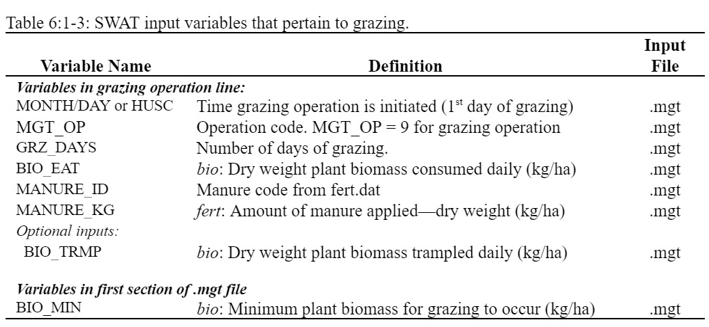

# Grazing Operation

&#x20;                The grazing operation simulates plant biomass removal and manure deposition over a specified period of time. This operation is used to simulate pasture or range grazed by animals.&#x20;

&#x20;                    Information required in the grazing operation includes the time during the year at which grazing begins (month and day or fraction of plant potential heat units), the length of the grazing period, the amount of biomass removed daily, the amount of manure deposited daily, and the type of manure deposited. The amount of biomass trampled is an optional input.&#x20;

&#x20;                       Biomass removal in the grazing operation is similar to that in the harvest operation. However, instead of a fraction of biomass being specified, an absolute amount to be removed every day is given. In some conditions, this can result in a reduction of the plant biomass to a very low level that will result in increased erosion in the HRU. To prevent this, a minimum plant biomass for grazing may be specified (BIO\_MIN). When the plant biomass falls below the amount specified for BIO\_MIN, the model will not graze, trample, or apply manure in the HRU on that day.&#x20;

&#x20;              If the user specifies an amount of biomass to be removed daily by trampling, this biomass is converted to residue.&#x20;

&#x20;              Nutrient fractions and bacteria content of the manure applied during grazing must be stored in the fertilizer database. The manure nutrient and bacteria loadings are added to the topmost 10 mm of soil. This is the portion of the soil with which surface runoff interacts.&#x20;

&#x20;              After biomass is removed by grazing and/or trampling, the plant’s leaf area index and accumulated heat units are set back by the fraction of biomass removed.

