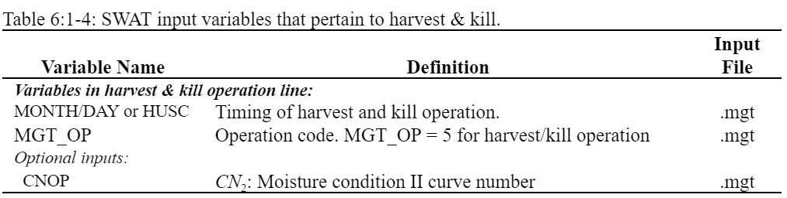

# Harvest & Kill Operation

&#x20;             The harvest and kill operation stops plant growth in the HRU. The fraction of biomass specified in the land cover’s harvest index (in the plant growth database) is removed from the HRU as yield. The remaining fraction of plant biomass is converted to residue on the soil surface.&#x20;

&#x20;                The only information required by the harvest and kill operation is the timing of the operation (month and day or fraction of plant potential heat units). The user also has the option of updating the moisture condition II curve number in this operation.

