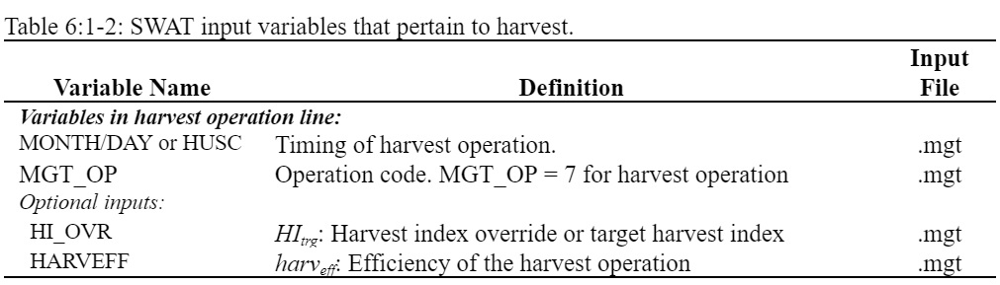

# Harvest Operation

&#x20;           The harvest operation will remove plant biomass without killing the plant. This operation is most commonly used to cut hay or grass.&#x20;

&#x20;              The only information required by the harvest operation is the date. However, a harvest index override and a harvest efficiency can be set.&#x20;

&#x20;                  When no harvest index override is specified, SWAT+ uses the plant harvest index from the plant growth database to set the fraction of biomass removed. The plant harvest index in the plant growth database is set to the fraction of the plant biomass partitioned into seed for agricultural crops and a typical fraction of biomass removed in a cutting for hay. If the user prefers a different fraction of biomass to be removed, the harvest index override should be set to the desired value.&#x20;

&#x20;                      A harvest efficiency may also be defined for the operation. This value specifies the fraction of harvested plant biomass removed from the HRU. The remaining fraction is converted to residue on the soil surface. If the harvest efficiency is left blank or set to zero, the model assumes this feature is not being used and removes 100% of the harvested biomass (no biomass is converted to residue).&#x20;

&#x20;                         After biomass is removed in a harvest operation, the plant’s leaf area index and accumulated heat units are set back by the fraction of biomass removed. Reducing the number of accumulated heat units shifts the plant’s development to an earlier period in which growth is usually occurring at a faster rate.

