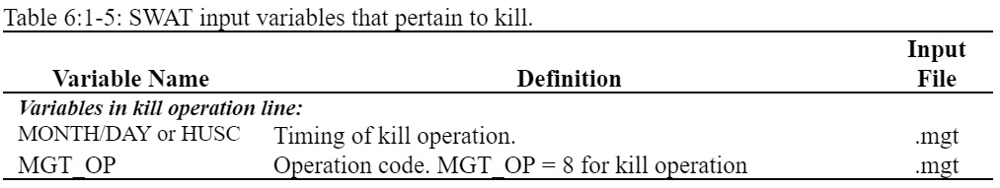

# Kill/End of Growing Season

&#x20;                 The kill operation stops plant growth in the HRU. All plant biomass is converted to residue.&#x20;

&#x20;                       The only information required by the kill operation is the timing of the operation (month and day or fraction of plant potential heat units).

