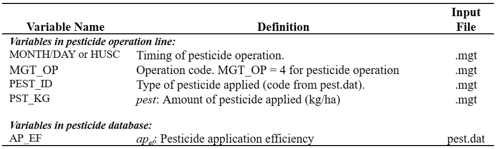

# Pesticide Application

&#x20;               The pesticide operation applies pesticide to the HRU.

&#x20;                Information required in the pesticide operation includes the timing of the operation (month and day or fraction of plant potential heat units), the type of pesticide applied, and the amount of pesticide applied.&#x20;

&#x20;                Field studies have shown that even on days with little or no wind, a portion of pesticide applied to the field is lost. The fraction of pesticide that reaches the foliage or soil surface is defined by the pesticide’s application efficiency. The amount of pesticide that reaches the foliage or ground is:

&#x20;                $$pest'=ap_{ef}*pest$$                                                                                        6:1.10.1

&#x20;    where $$pest'$$ is the effective amount of pesticide applied (kg pst/ha), $$ap_{ef}$$ is the pesticide application efficiency, and pest is the actual amount of pesticide applied (kg pst/ha).

&#x20;    The amount of pesticide reaching the ground surface and the amount of pesticide added to the plant foliage is calculated as a function of ground cover. The ground cover provided by plants is:

&#x20;                $$gc=\frac{1.99532-erfc[1.333*LAI-1]}{2.1}$$                                                                       6:1.10.2

&#x20;     where $$gc$$ is the fraction of the ground surface covered by plants, $$erfc$$ is the complementary error function, and $$LAI$$ is the leaf area index.&#x20;

&#x20;     The complementary error function frequently occurs in solutions to advective-dispersive equations. Values for $$erfc(\beta)$$ and $$erf(\beta)$$ (erf is the error function for $$\beta$$), where $$\beta$$ is the argument of the function, are graphed in Figure 6:1-1. The figure shows that $$erf(\beta)$$ ranges from –1 to +1 while $$erfc(\beta)$$ ranges from 0 to +2. The complementary error function takes on a value greater than 1 only for negative values of the argument.&#x20;

&#x20;       Once the fraction of ground covered by plants is known, the amount of pesticide applied to the foliage is calculated:

&#x20;                 $$pest_{fol}=gc*pest'$$                                                                                    6:1.10.3

and the amount of pesticide applied to the soil surface is

&#x20;                 $$pest_{surf}=(1-gc)*pest'$$                                                                       6:1.10.4

where $$pest_{fol}$$ is the amount of pesticide applied to foliage (kg pst/ha), $$pest_{surf}$$ is the amount of pesticide applied to the soil surface (kg pst/ha), $$gc$$ is the fraction of the ground surface covered by plants, and $$pest'$$  is the effective amount of pesticide applied (kg pst/ha).

Table 6:1-10: SWAT+ input variables that pertain to pesticide application.

