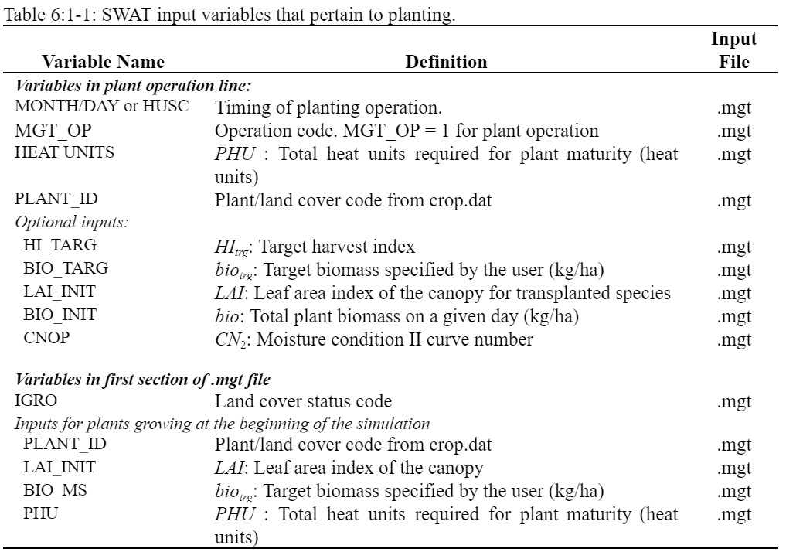

# Planting/Beginning of Growing Season

&#x20;       The plant operation initiates plant growth. This operation can be used to designate the time of planting for agricultural crops or the initiation of plant growth in the spring for a land cover that requires several years to reach maturity (forests, orchards, etc.).&#x20;

&#x20;           The plant operation will be performed by SWAT+ only when no land cover is growing in an HRU. Before planting a new land cover, the previous land cover must be removed with a kill operation or a harvest and kill operation. If two plant operations are placed in the management file and the first land cover is not killed prior to the second plant operation, the second plant operation is ignored by the model.&#x20;

&#x20;                   Information required in the plant operation includes the timing of the operation (month and day or fraction of base zero potential heat units), the total number of heat units required for the land cover to reach maturity, and the specific land cover to be simulated in the HRU. If the land cover is being transplanted, the leaf area index and biomass for the land cover at the time of transplanting must be provided. Also, for transplanted land covers, the total number of heat units for the land cover to reach maturity should be from the period the land cover is transplanted to maturity (not from seed generation). Heat units are reviewed in Chapter 5:1.&#x20;

&#x20;                           The user has the option of varying the curve number in the HRU throughout the year. New curve number values may be entered in a plant operation, tillage operation and harvest and kill operation. The curve number entered for these operations are for moisture condition II. SWAT+ adjusts the entered value daily to reflect change in water content or plant evapotranspiration.&#x20;

&#x20;                                   For simulations where a certain amount of crop yield and biomass is required, the user can force the model to meet this amount by setting a harvest index target and a biomass target. These targets are effective only if a harvest and kill operation is used to harvest the crop.

