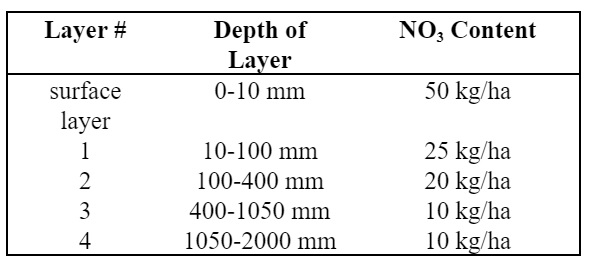
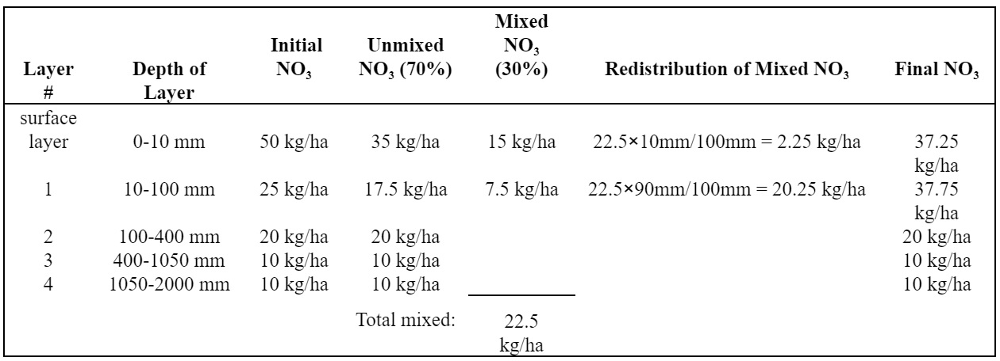

# Tillage

&#x20;     The tillage operation redistributes residue, nutrients, pesticides and bacteria in the soil profile. Information required in the tillage operation includes the timing of the operation (month and day or fraction of base zero potential heat units), and the type of tillage operation.&#x20;

&#x20;            The user has the option of varying the curve number in the HRU throughout the year. New curve number values may be entered in a plant operation, tillage operation and harvest and kill operation. The curve number entered for these operations are for moisture condition II. SWAT+ adjusts the entered value daily to reflect change in water content.&#x20;

&#x20;                 The mixing efficiency of the tillage implement defines the fraction of a residue/nutrient/pesticide/bacteria pool in each soil layer that is redistributed through the depth of soil that is mixed by the implement. To illustrate the redistribution of constituents in the soil, assume a soil profile has the following distribution of nitrate.

&#x20;        If this soil is tilled with a field cultivator, the soil will be mixed to a depth of 100 mm with 30% efficiency. The change in the distribution of nitrate in the soil is:

&#x20;          Because the soil is mixed to a depth of 100 mm by the implement, only the nitrate in the surface layer and layer 1 is available for redistribution. To calculated redistribution, the depth of the layer is divided by the tillage mixing depth and multiplied by the total amount of nitrate mixed. To calculate the final nitrate content, the redistributed nitrate is added to the unmixed nitrate for the layer.&#x20;

&#x20;            All nutrient/pesticide/bacteria/residue pools are treated in the same manner as the nitrate example above. Bacteria mixed into layers below the surface layer is assumed to die.
