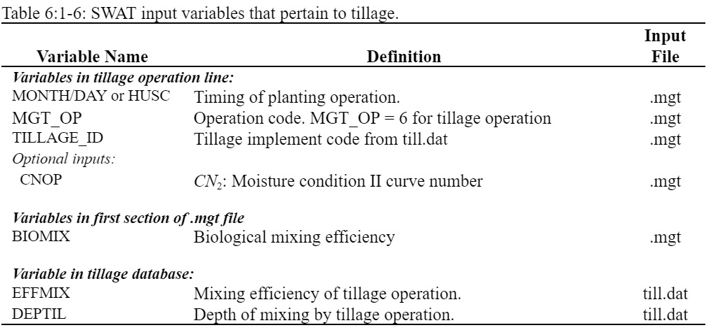

# Biological Mixing

&#x20;                     Biological mixing is the redistribution of soil constituents as a result of the activity of biota in the soil (e.g. earthworms, etc.). Studies have shown that biological mixing can be significant in systems where the soil is only infrequently disturbed. In general, as a management system shifts from conventional tillage to conservation tillage to no-till there will be an increase in biological mixing. SWAT+ allows biological mixing to occur to a depth of 300 mm (or the bottom of the soil profile if it is shallower than 300 mm). The efficiency of biological mixing is defined by the user. The redistribution of nutrients by biological mixing is calculated using the same methodology as that used for a tillage operation.

