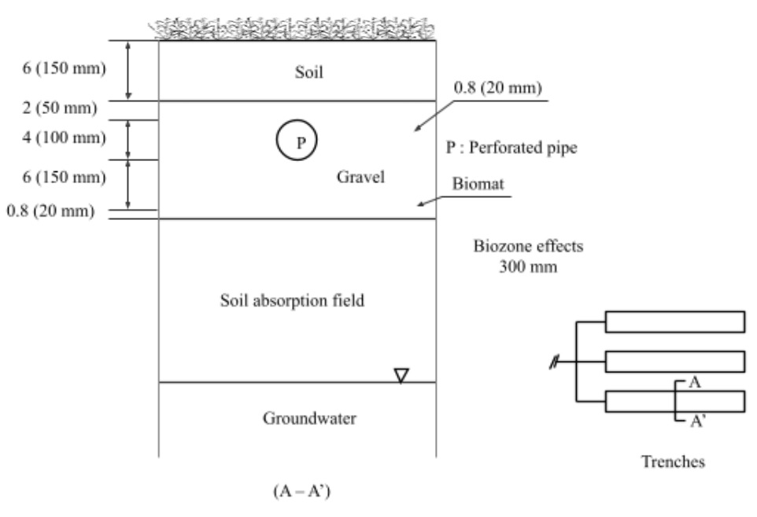

# Buildup of Live Bacterial Biomass

The biozone layer is formed as a biologically active layer in the soil absorption system near the infiltrative surface by the growth of microorganisms feeding on the organic matter (BOD) of the septic tank effluent (See Figure 6:4-1).  The amount of live bacteria biomass in the biozone is estimated using a mass balance equation assuming the biozone as a control volume. The mass balance equation of microorganisms (live bacteria biomass) in the control volume is then estimated by:

&#x20;  $$\frac{d(Bio)}{dt}=\alpha*[\sum Q_{STE}*C_{BOD,in}-I_p*C_{BOD}]-R_{resp}-R_{mort}-R_{slough}$$                 (1)

where $$Bio$$ is the amount of live bacteria biomass in biozone (kg/ha), $$C_{BOD}$$,in is the $$BOD$$concentration in the $$STE$$ (mg/L), $$C_{BOD}$$ is the $$BOD$$ concentration in biozone (mg/L), $$\alpha$$ is gram of live bacteria growth to gram of $$BOD$$ in STE (conversion factor), $$Q_{STE}$$ is the flow rate of $$STE$$ (m$$^3$$/day), Ip is the amount of percolation out of the biozone (m$$^3$$/day), $$R_{resp}$$ is the amount of  respiration of bacteria (kg/ha), $$R_{mort}$$ is the amount of mortality of bacteria (kg/ha), and $$R_{slough}$$ is the amount of sloughed off bacteria (kg/ha).

