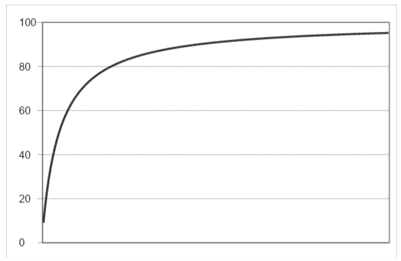

# Build Up/Wash Off

&#x20;       In an impervious area, dust, dirt and other constituents are built up on street surfaces in periods of dry weather preceding a storm. Build up may be a function of time, traffic flow, dry fallout and street sweeping. During a storm runoff event, the material is then washed off into the drainage system. Although the build up/wash off option is conceptually appealing, the reliability and credibility of the simulation may be difficult to establish without local data for calibration and validation (Huber and Dickinson, 1988).&#x20;

&#x20;        When the build up/wash off option is used in SWAT+, the urban hydrologic response unit (HRU) is divided into pervious and impervious areas. Management operations other than sweep operations are performed in the pervious portion of the HRU. Sweep operations impact build up of solids in the impervious portion of the HRU. For the pervious portion of the HRU, sediment and nutrient loadings are calculated using the methodology summarized in Chapters 4:1 and 4:2. The impervious portion of the HRU uses the build up/wash off algorithm to determine sediment and nutrient loadings.&#x20;

&#x20;         The build up/wash off algorithm calculates the build up and wash off of solids. The solids are assumed to possess a constant concentration of organic and mineral nitrogen and phosphorus where the concentrations are a function of the urban land type.&#x20;

&#x20;    Build up of solids is simulated on dry days with a Michaelis-Menton equation:

&#x20;                $$SED=\frac{SED_{mx}*td}{(t_{half}+td)}$$                                                                                                   6:3.4.1

&#x20;        where $$SED$$ is the solid build up (kg/curb km) $$td$$ days after the last occurrence of $$SED=0$$ kg/curb km, $$SED_{mx}$$ is the maximum accumulation of solids possible for the urban land type (kg/curb km), and $$t_{half}$$ is the length of time needed for solid build up to increase from 0 kg/curb km to $$\frac{1}{2}  SED_{mx}$$(days). A dry day is defined as a day with surface runoff less than 0.1 mm. An example build-up curve is shown in Figure 6:3-1. As can be seen from the plot, the Michaelis-Menton function will initially rise steeply and then approach the asymptote slowly.

The two parameters that determine the shape of this curve are $$SED_{mx}$$ and $$t_{half}$$. These parameters are a function of the urban land type.&#x20;

&#x20;    Wash off is the process of erosion or solution of constituents from an impervious surface during a runoff event. An exponential relationship is used to simulate the wash off process (Huber and Dickinson, 1988):

&#x20;           $$Y_{sed}=SED_0*(1-e^{-kk*t})$$                                                                                     6:3.4.2

where $$Y_{sed}$$ is the cumulative amount of solids washed off at time $$t$$ (kg/curb km), $$SED_0$$ is the amount of solids built up on the impervious area at the beginning of the precipitation event (kg/curb km), and $$kk$$ is a coefficient.&#x20;

&#x20;     The coefficient, $$kk$$, may be estimated by assuming it is proportional to the peak runoff rate:

&#x20;                 $$kk=urb_{coef}*q_{peak}$$                                                                                             6:3.4.3

where $$urb_{coef}$$ is the wash off coefficient (mm$$^{-1}$$) and $$q_{peak}$$ is the peak runoff rate (mm/hr).&#x20;

&#x20;               The original default value for $$urb_{coef}$$ was calculated as 0.18 mm-1 by assuming that 13 mm of total runoff in one hour would wash off 90% of the initial surface load. Later estimates of $$urb_{coef}$$ gave values ranging from 0.002-0.26 mm$$^{-1}$$. Huber and Dickinson (1988) noted that values between 0.039 and 0.390 mm-1 for $$urb_{coef}$$ give sediment concentrations in the range of most observed values. They also recommended using this variable to calibrate the model to observed data.&#x20;

&#x20;                To convert the sediment loading from units of kg/curb km to kg/ha, the amount of sediment removed by wash off is multiplied by the curb length density. The curb length density is a function of the urban land type. Nitrogen and phosphorus loadings from the impervious portion of the urban land area are calculated by multiplying the concentration of nutrient by the sediment loading.
