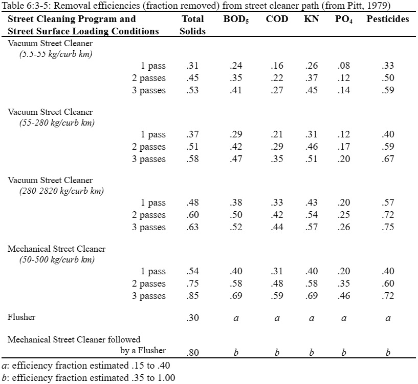

# Street Cleaning

Street cleaning is performed in urban areas to control buildup of solids and trash. While it has long been thought that street cleaning has a beneficial effect on the quality of urban runoff, studies by EPA have found that street sweeping has little impact on runoff quality unless it is performed every day (U.S. Environmental Protection Agency, 1983).&#x20;

&#x20;        SWAT+ performs street sweeping operations only when the build up/wash off algorithm is specified for urban loading calculations. Street sweeping is performed only on dry days, where a dry day is defined as a day with less than 0.1 mm of surface runoff. The sweeping removal equation (Huber and Dickinson, 1988) is:

&#x20;          $$SED=SED_0*(1-fr_{av}*reff)$$                                                                         6:3.4.4

where $$SED$$ is amount of solids remaining after sweeping (kg/curb km), $$SED_0$$ is the amount of solids present prior to sweeping (kg/curb km), $$fr_{av}$$ is the fraction of the curb length available for sweeping (the availability factor), and $$reff$$ is the removal efficiency of the sweeping equipment. The availability factor and removal efficiency are specified by the user.

&#x20;The availability factor, $$fr_{av}$$, is the fraction of the curb length that is sweepable. The entire curb length is often not available for sweeping due to the presence of cars and other obstacles.&#x20;

&#x20;                  The removal efficiency of street sweeping is a function of the type of sweeper, whether flushing is a part of the street cleaning process, the quantity of total solids, the frequency of rainfall events and the constituents considered. Removal efficiency can vary depending on the constituent being considered, with efficiencies being greater for particulate constituents. The removal efficiencies for nitrogen and phosphorus are typically less than the solid removal efficiency (Pitt, 1979). Because SWAT+ assumes a set concentration of nutrient constituents in the solids, the same removal efficiency is in effect used for all constituents. Table 6:3-5 provides removal efficiencies for various street cleaning programs.

Table 6:3-6: SWAT+ input variables that pertain to build up/wash off.

| Variable Name | Definition                                                                                                                     | Input File |
| ------------- | ------------------------------------------------------------------------------------------------------------------------------ | ---------- |
| IURBAN        | Urban simulation code                                                                                                          | .mgt       |
| URBLU         | Urban land type identification number from urban database                                                                      | .mgt       |
| DIRTMX        | $$SED_{mx}$$: maximum amount of solids allowed to build up on impervious areas (kg/curb km)                                    | urban.dat  |
| THALF         | $$t_{half}$$: number of days for amount of solids on impervious area to build up from 0 kg/curb km to $$\frac{1}{2} SED_{mx}$$ | urban.dat  |
| URBCOEF       | $$urb_{coef}$$: wash off coefficient (mm$$^{-1}$$)                                                                             | urban.dat  |
| CURBDEN       | curb length density in urban land type (km/ha)                                                                                 | urban.dat  |
| TNCONC        | concentration of total nitrogen in suspended solid load (mg N/kg)                                                              | urban.dat  |
| TPCONC        | concentration of total phosphorus in suspended solid load (mg N/kg)                                                            | urban.dat  |
| TNO3CONC      | concentration of nitrate in suspended solid load (mg N/kg)                                                                     | urban.dat  |
| SWEEPEFF      | $$reff$$: removal efficiency of the sweeping equipment                                                                         | .mgt       |
| FR\_CURB      | $$fr_{av}$$: fraction of the curb length that is sweepable.                                                                    | .mgt       |
