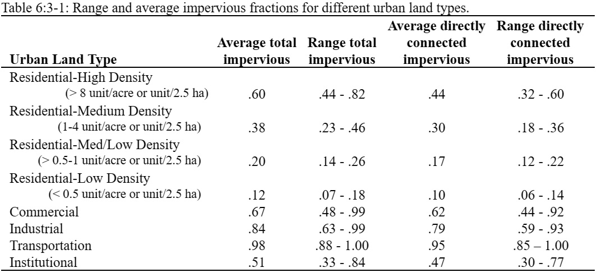

# Characteristics of Urban Areas

Urban areas differ from rural areas in the fraction of total area that is impervious. Construction of buildings, parking lots and paved roads increases the impervious cover in a watershed and reduces infiltration. With development, the spatial flow pattern of water is altered and the hydraulic efficiency of flow is increased through artificial channels, curbing, and storm drainage and collection systems. The net effect of these changes is an increase in the volume and velocity of runoff and larger peak flood discharges.&#x20;

&#x20;                     Impervious areas can be differentiated into two groups: the area that is hydraulically connected to the drainage system and the area that is not directly connected. As an example, assume there is a house surrounded by a yard where runoff from the roof flows into the yard and is able to infiltrate into the soil. The rooftop is impervious but it is not hydraulically connected to the drainage system. In contrast, a parking lot whose runoff enters a storm water drain is hydraulically connected. Table 6:3-1 lists typical values for impervious and directly connected impervious fractions in different urban land types.

&#x20;                During dry periods, dust, dirt and other pollutants build up on the impervious areas. When precipitation events occur and runoff from the impervious areas is generated, the runoff will carry the pollutants as it moves through the drainage system and enters the channel network of the watershed.
