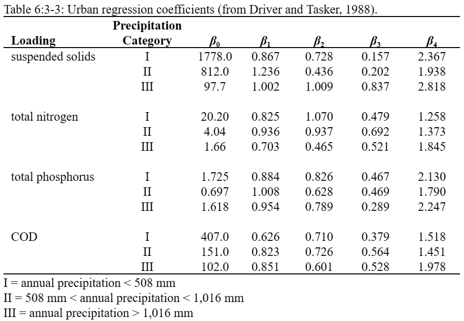

# USGS Regression Equations

&#x20;   The linear regression models incorporated into SWAT+ are those described by Driver and Tasker (1988). The regression models were developed from a national urban water quality database that related storm runoff loads to urban physical, land use, and climatic characteristics. USGS developed these equations to predict loadings in ungaged urban watersheds.&#x20;

&#x20;            The regression models calculate loadings as a function of total storm rainfall, drainage area and impervious area. The general equation is

&#x20;         $$Y=\frac{\beta_0*(R_{day}/25.4)^{\beta_1}*(DA*imp_{tot}/2.59)^{\beta_2}*(imp_{tot}*100+1)^{\beta_3}*\beta_4}{2.205}$$                                                    6:3.3.1

where $$Y$$ is the total constituent load (kg), $$R_{day}$$ is precipitation on a given day (mm H$$_2$$O), $$DA$$ is the HRU drainage area (km$$^2$$), $$imp_{tot}$$ is the fraction of the total area that is impervious, and the $$\beta$$ variables are regression coefficients. The regression equations were developed in English units, so conversion factors were incorporated to adapt the equations to metric units: 25.4 mm/inch, 2.59 km2/mi2, and 2.205 lb/kg.&#x20;

&#x20;         USGS derived three different sets of regression coefficients that are based on annual precipitation. Category I coefficients are used in watersheds with less than 508 mm of annual precipitation. Category II coefficients are used in watersheds with annual precipitation between 508 and 1016 mm. Category III coefficients are used in watersheds with annual precipitation greater than 1016 mm. SWAT+ determines the annual precipitation category for each subbasin by summing the monthly precipitation totals provided in the weather generator input file.&#x20;

&#x20;              Regression coefficients were derived to estimate suspended solid load, total nitrogen load, total phosphorus load and carbonaceous oxygen demand (COD). SWAT+ calculates suspended solid, total nitrogen, and total phosphorus loadings (the carbonaceous oxygen demand is not currently calculated). Regression coefficients for these constituents are listed in Table 6:3-3.&#x20;

&#x20;                 Once total nitrogen and phosphorus loads are calculated, they are partitioned into organic and mineral forms using the following relationships from Northern Virginia Planning District Commission (1979). Total nitrogen loads consist of 70 percent organic nitrogen and 30 percent mineral (nitrate). Total phosphorus loads are divided into 75 percent organic phosphorus and 25 percent orthophosphate.

Table 6:3-4: SWAT+ input variables that pertain to urban modeling with regression equations.

| Variable Name | Definition                                                     | Input File |
| ------------- | -------------------------------------------------------------- | ---------- |
| IURBAN        | Urban simulation code                                          | .mgt       |
| URBLU         | Urban land type identification number from urban database      | .mgt       |
| FIMP          | Fraction of HRU that is impervious. $$imp_{tot}$$= FIMP\* 100  | urban.dat  |
| PRECIPITATION | $$R_{day}$$: Precipitation on a given day (mm H$$_2$$O)        | .pcp       |
| HRU\_FR       | Fraction of subbasin area in HRU                               | .hru       |
| SUB\_KM       | Area of subbasin (km$$^2$$)                                    | .sub       |
| PCPMM(mon)    | Average amount of precipitation falling in month (mm H$$_2$$O) | .wgn       |
