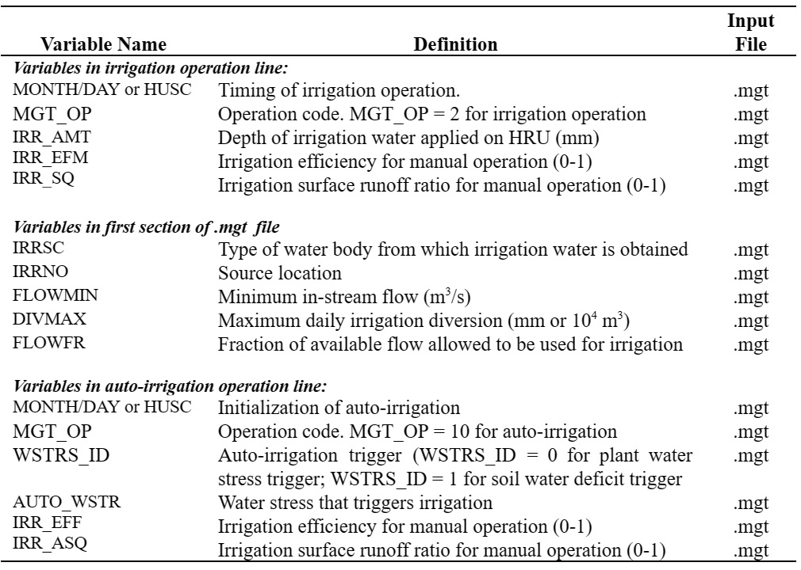

# Auto-Application of Irrigation

&#x20;                 When the user selects auto-application of irrigation, the application can be triggered by a water stress threshold or a soil water deficit threshold.  The water stress threshold is a fraction of potential plant growth.  Any day actual plant stress falls below this threshold fraction due to water stress, the model will automatically apply water up to a maximum amount per application as input by the user.  An irrigation application can also be triggered by a soil water deficit threshold.  When total soil water in the profile falls below field capacity by more than the soil water deficit threshold, an irrigation application occurs.  As with a manual application, a maximum irrigation amount, irrigation efficiency and surface runoff ratio are applied to each application.

Table 6:2-1: SWAT+ input variables that pertain to irrigation.

