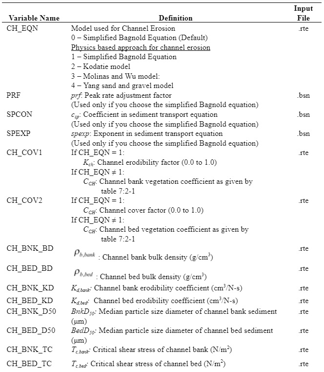

# Channel Cover Factor

The channel cover factor, $$C_{CH}$$, is defined as the ratio of degradation from a channel with a specified vegetative cover to the corresponding degradation from a channel with no vegetative cover. The vegetation affects degradation by reducing the stream velocity, and consequently its erosive power, near the bed surface.

Table 7:2-1: SWAT+ input variables that pertain to sediment routing.

