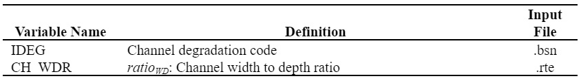

# Channel Downcutting and Widening

&#x20;             While sediment transport calculations have traditionally been made with the same channel dimensions throughout a simulation, SWAT+ will model channel downcutting and widening. When channel downcutting and widening is simulated, channel dimensions are allowed to change during the simulation period.

&#x20;             Three channel dimensions are allowed to vary in channel downcutting and widening simulations: bankfull depth, $$depth_{bnkfull}$$, channel width, $$W_{bnkfull}$$, and channel slope, $$slp_{ch}$$. Channel dimensions are updated using the following equations when the volume of water in the reach exceeds 1.4 × 106 m$$^3$$.

&#x20;              The amount of downcutting is calculated (Allen et al., 1999):

&#x20;                       $$depth_{dcut}=358.6*depth*slp_{ch}*K_{CH}$$                                           7:2.5.1

&#x20;             where $$depth_{dcut}$$ is the amount of downcutting (m), $$depth$$ is the depth of water in channel (m), $$slp_{ch}$$ is the channel slope (m/m), and $$K_{CH}$$ is the channel erodibility coefficient (cm/h/Pa).

&#x20;               The new bankfull depth is calculated:

&#x20;                     $$depth_{bnkfull}=depth_{bnkfull,i}+depth_{dcut}$$                                            7:2.5.2

where $$depth_{bnkfull}$$ is the new bankfull depth (m), $$depth_{bnkfull,i}$$ is the previous bankfull depth, and $$depth_{dcut}$$ is the amount of downcutting (m).

&#x20;                The new bank width is calculated:

&#x20;                         $$W_{bnkfull}=ratio_{WD}*depth_{bnkfull}$$                                                   7:2.5.3

where $$W_{bnkfull}$$ is the new width of the channel at the top of the bank (m), $$ratio_{WD}$$ is the channel width to depth ratio, and $$depth_{bnkfull}$$ is the new bankfull depth (m).

&#x20;                 The new channel slope is calculated:

&#x20;                             $$slp_{ch}=slp_{ch,i}-\frac{depth_{dcut}}{1000*L_{ch}}$$                                                               7:2.5.4

where $$slp_{ch}$$ is the new channel slope (m/m), $$slp_{ch,i}$$ is the previous channel slope (m/m), $$depth_{bnkfull}$$ is the new bankfull depth (m), and $$L_{ch}$$ is the channel length (km).

Table 7:2-2: SWAT+ input variables that pertain to channel downcutting and widening.

