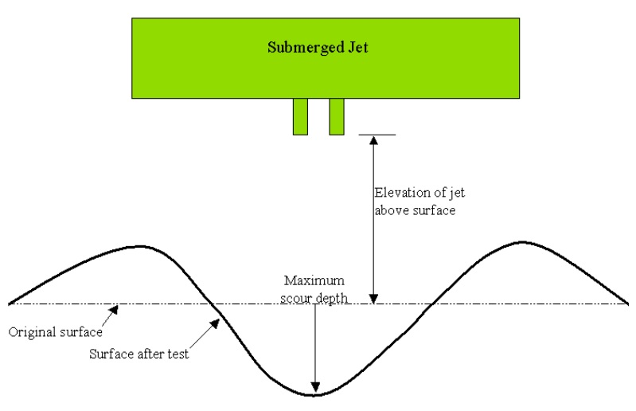

# Channel Erodibility Factor

&#x20;        The channel erodibility factor is conceptually similar to the soil erodibility factor used in the USLE equation. Channel erodibility is a function of properties of the bed or bank materials.

&#x20;           Channel erodibility can be measured with a submerged vertical jet device. The basic premise of the test is that erosion of a vegetated or bare channel and local scour beneath an impinging jet are the result of hydraulic stresses, boundary geometry, and the properties of the material being eroded. Hanson (1990) developed a method for determining the erodibility coefficient of channels in situ with the submerged vertical jet. Allen et al. (1999) utilized this method to determine channel erodibility factors for thirty sites in Texas.

&#x20;           A submerged, vertical jet of water directed perpendicularly at the channel bed causes erosion of the bed material in the vicinity of the jet impact area (Figure 7:2-1). Important variables in the erosion process are: the volume of material removed during a jetting event, elevation of the jet above the ground surface, diameter of the jet nozzle, jet velocity, time, mass density of the fluid and coefficient of erodibility.

&#x20;           Hanson (1991) defined a jet index, J$$_i$$, to relate erodibility to scour created by the submerged jet. The jet index is a function of the depth of scour beneath the jet per unit time and the jet velocity. The jet index is determined by a least squares fit following the procedures outlined in ASTM standard D 5852-95.

Once the jet index is determined, the channel erodibility coefficient is calculated:

&#x20;           $$K_{d,bank|bed}=0.003*exp[385*J_i]$$                                                                     7:2.3.1

where $$K_{d,bank|bed}$$ is the channel bankd/bed erodibility coefficient (cm$$^3$$/N-s) and $$J_i$$ is the jet index. In general, values for channel erodibility are an order of magnitude smaller than values for soil erodibility.
